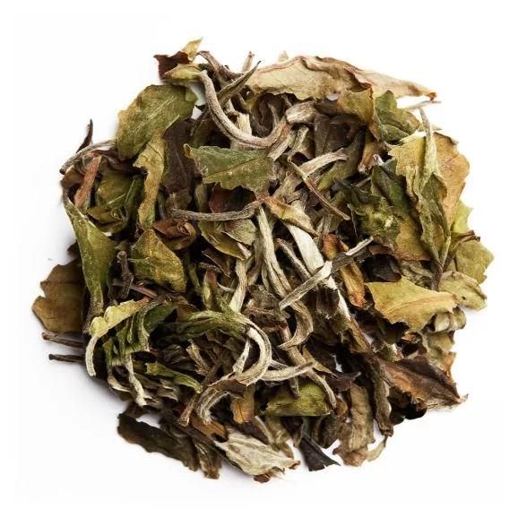

Preparation:

- **Temperature:** 167°F / 75°C
- **Time:** 8 min, 20 sec
- **Tea Amount:** 7.5 g
- **Water Volume:** 15 oz / 450 ml 

## Overview

This tea is part of the list of the [teas I got this month](https://skoomaden.me/posts/teas-arriving-in-may/).

Would you believe me if I told you I tried this tea 4 times in 4 different ways before writing this review?
I simply couldn't believe it was as bad as I thought it was, so I tried it again and again, and again, and again.

First, I tried Gong Fu Style in two different combinations of time and temperature, then I tried it in a temperature-controlled tea maker, and finally, I tried it in a regular teapot.
The first time, I thought that perhaps Gong Fu Style wasn't made for this tea, the second time, I thought perhaps I had too much concentration, then, I thought that perhaps the temperature dropping during the infusion (since the infusion time is 8-10 min) was the cause, and finally, as I am writing this review, the tea is in a teapot, and I am waiting for it to cool down to see if it's better cold.

Now let's see how Palais Des Thés describes this tea:

*From Palais des Thés:*

*"White peony" is a very fine tea, made up of all sorts of leaves in their natural state: silvery buds, Souchong leaves, first and second leaves and stems.*
*Its woody taste is like the autumn fruits: hazelnuts and chestnuts.*

Alright, pretty self-explanatory, onto the tasting notes.

I'm going to break down every single tasting experience I had with this tea, and then I'll give you my final thoughts.

### First time, Gong Fu Style (successive 20s, 75°C)

"What the hell am I drinking?" must've been my first thought. It wasn't the bitterness that struck me, but the toughness of the tea. It was like drinking a very old, very dry, very woody piece of wood. The taste was so strong, so overpowering, that I couldn't even taste the bitterness. I thought perhaps I had too much tea in the gaiwan, so I tried again.

### Second time, Gong Fu Style (successive 10s, 75°C)

Okay, less tea, less time, maybe that's the trick. But no, the tea was still as strong, as overpowering, as woody. I couldn't even taste the bitterness. I thought perhaps the method itself was wrong.

### Third time, Temperature-Controlled Tea Maker (8 min, 75°C)

Ark! Strong as hell this one, overpowering, woody, dry, old, and strong, and most importantly, not anything like a Bai Mu Dan.

### Fourth time, Regular Teapot (8 min, 75°C)

Huh, is this it?
Is this the tea I've been trying to taste for the past 2 hours?
It's so incredibly light, so incredibly tasteless, so incredibly... boring.

But still woody, still like what a minecraft birch plank would taste like, still not a Bai Mu Dan.

But I cannot say it's bad, because it isn't. "Truly I was the one to blame by trying to taste it in a way it wasn't meant to be tasted."
But why would this Bai Mu Dan not be meant to be tasted in Gong Fu Style? Why would it be so strong, so overpowering, so woody?

### Final thoughts

Not every white tea can be tasted Gong Fu Style, and this one is a perfect example of that. It's not bad, it's not good, it's just... there. It's a tea that you can drink without thinking about it, without tasting it, without enjoying it. It's a tea that you can drink while doing something else, while talking, while working, while reading, while watching TV.
It's a non-tea, it's not light yet with character as I wished it would've been, and after trying a stable method, and under these very specific and controlled conditions, I can say that it's an overpriced tea that does what it's supposed to.

I would feel it to be unfair to judge it badly, my apprehensions disappeared after the last tasting, but I cannot say it's good either.

#### My recommendation: This is a correct white tea, unremarkable, needs more definition, very light and fair.

## Rating:

- **Flavor Complexity:** 10/30 - The tea lacked depth and distinctive flavors.
- **Brewing Forgiveness:** 10/20 - Difficult to get right, with inconsistent results across methods.
- **Consistency Across Infusions:** 8/20 - Varied widely, mostly disappointing.
- **Overall Enjoyment:** 10/30 - Despite its shortcomings, it's drinkable and fair.

# 38/100

*- yaro*
