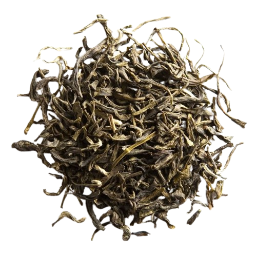

I recently tried Grand Jasmin Mao Feng, a jasmine tea from Palais des Thés. Here's my detailed review of the experience:

Preparation:

- **Temperature:** 165°F / 73°C
- **Time:** 0 min, 30 sec
- **Tea Amount:** 5 g
- **Water Volume:** 3 oz / 100 ml

## Overview

Palais des Thés calls this one subtle and creamy. Let's see, we steep at 75°C with a steep of 25 seconds.

### Second Steep:

Slightly bitter, jasmine lacks definition, shocking for this price point.

### Third Steep:

Bitter, bitter, bitter and gross. It’s not all over the place though; I can see that the jasmine itself is the cause of the bitterness, like drinking ear wax: ew.

### Fourth Steep:

Oh wow, this is just bad, bad bad bad. Where’s the creaminess? Where’s the subtlety? I cannot describe how bitter this is; it’s like ear wax with extra ear wax.

## Conclusion:

Worst jasmine tea I’ve had, and I wish I was kidding.

Flavors: Bitter, Jasmine, Wax

## Rating:

- **Flavor Complexity:** 5/30 - Lacks depth and is overwhelmingly bitter.
- **Brewing Forgiveness:** 5/20 - Very sensitive to brewing parameters, easily becomes undrinkable.
- **Consistency Across Infusions:** 5/20 - Consistently unpleasant across multiple steeps.
- **Overall Enjoyment:** 5/30 - Not enjoyable at all.

# 20/100

<mark>- yaro</mark>
