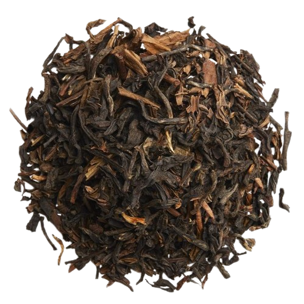

I recently tried Le Temps Retrouvé from Palais des Thés.

This is a complex blend of green and black teas.

## Description by Palais des Thés
Le Temps Retrouvé is a unique blend that brings together the best characteristics of both green and black teas. With light jasmine notes and a hint of smokiness, it offers a perfect harmony that is both intriguing and satisfying. The blend is designed to be enjoyed at any time of day, providing a rich and full-bodied experience without overwhelming the senses.

## Preparation

- **Temperature:** 195°F / 90°C
- **Time:** 15s for each steep
- **Tea Amount:** 4 g
- **Water Volume:** 3 oz / 100 mL

## Overview

Le Temps Retrouvé is surprisingly complex for a PDT blend, with a perfect balance of flavors from both green and black teas.

### Steepings

#### 1st Steep (195°F / 90°C, 15s)

Ooooh complex this one, I really like this! For a PDT blend, I sure expected less. For a first steep, this has some light notes of jasmine, just a bit smoky too, with some common features we can find in both greens and blacks. This is a surprisingly good tea!

#### 2nd Steep (195°F / 90°C, 15s)

The soup is oddly thick, but in a good way. I cannot really describe it, it’s just a very satisfying tea, a perfect blend of both tea types where one doesn’t overwhelm the other. I wouldn’t be able to pinpoint specific flavors however, it really has a tiny bit of everything.

#### 3rd Steep (195°F / 90°C, 15s)

Light, thick, and round. That’s all this is. I love it. I really love it. Rare PDT W?

## Overall Impression

Le Temps Retrouvé is a complex, yet light tea that is very pleasant. It handles different temperatures well and maintains high quality across infusions.

## Rating:

- **Flavor Complexity:** 25/30 – This is a rather complex tea, yet it’s very light which makes it very pleasant.
- **Brewing Forgiveness:** 20/20 – Contrary to pure green tea, this seemed to handle different temperatures pretty well.
- **Quality Across Infusions:** 20/20 – This was all very surprising, high quality and delicious tea.
- **Overall Enjoyment:** 20/30 – I really liked it!

# 85/100

*- yaro*
