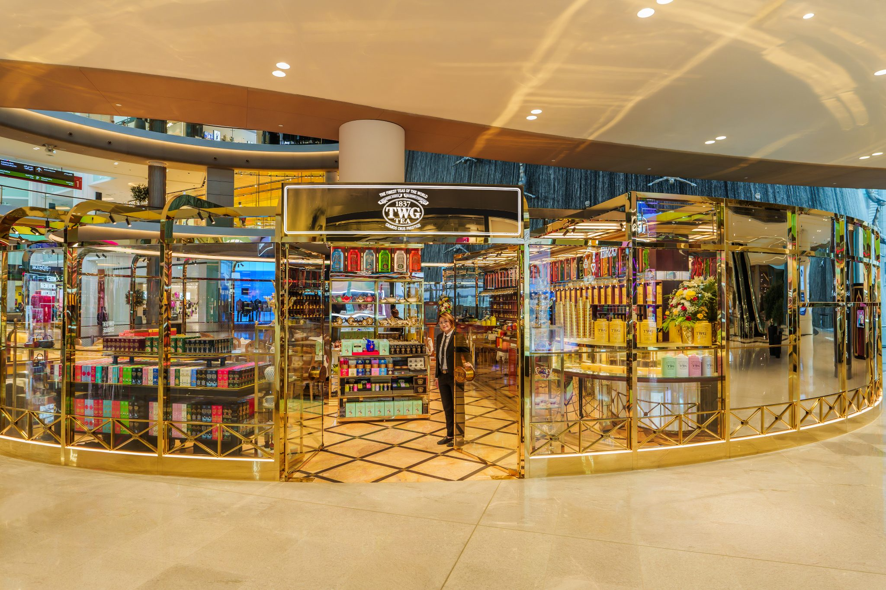
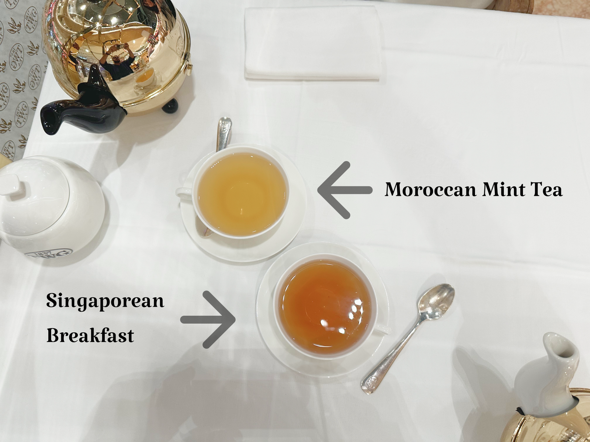
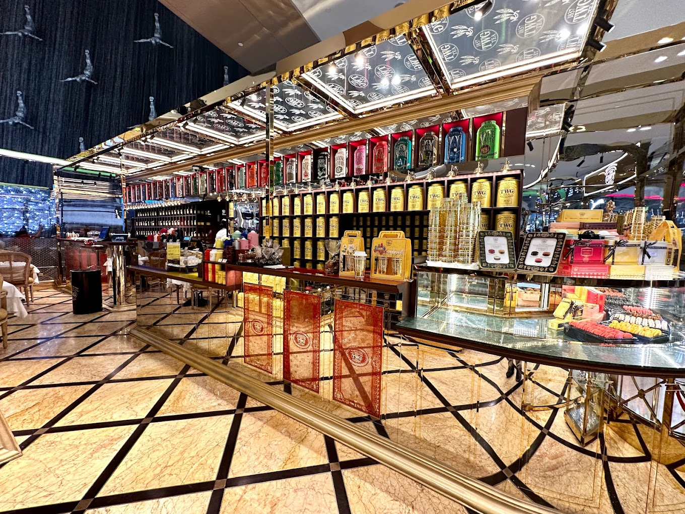

[TWG](https://twgtea.com), a Singaporean tea brand, is often criticized as an overpriced imitation of Mariage Frères. Some tea enthusiasts argue that TWG's luxurious image and historical claims are inflated. While this perspective has some merit, it’s not entirely accurate.

[TWG](https://twgtea.com)'s use of "1837" references Singapore’s opening of its trade market, not the brand’s founding in 2008. The resemblance to Mariage Frères in both language and design is evident, with some teas sharing names (e.g., [Sakura! Sakura!](https://www.reddit.com/r/tea/comments/1bzsg3x/whos_copying_who_now/)). Additionally, [TWG](https://twgtea.com)'s heavily perfumed teas often divide opinions.

Founded by [Manoj M. Murjani](https://www.linkedin.com/in/manoj-m-murjani-5010b098?originalSubdomain=sg), a Hong Kong-born Indian, and [Taha Bouqdib](https://www.linkedin.com/in/taha-bouqdib-a60856a/), a French-Moroccan tea sommelier, [TWG](https://twgtea.com) aimed to fill a niche for luxury French-style tea in Asia. Singapore’s diverse identity and strategic position made it an ideal location.

[TWG](https://twgtea.com) prides itself on its international reputation, claiming mastery over teas from around the world. This is a bold statement, given that many Asian tea houses specialize in specific types of tea. European brands with similar claims have often disappointed me. The phrase "Jack of all trades, master of none" came to mind when reading their extensive tea list, reminding me of Palais des Thés' overly artificial teas—an experience I prefer not to repeat.

With this complex reputation in mind, my first visit to a [TWG](https://twgtea.com) shop was clouded by low expectations. I went with my girlfriend, hoping they could provide an unbiased perspective on the tea's taste.

## Arrival at the Teahouse

I visited [TWG](https://twgtea.com) Tea at [Dubai Mall](https://en.wikipedia.org/wiki/Dubai_Mall), which serves as both a teahouse and a teashop. Prices range from 10-30 USD for a 400mL teapot. After being seated next to the fountain, I decided to order two teas strategically, which I will describe as I review them.

## First Tea: Moroccan Mint Tea

As someone from the region, I know [Moroccan tea](https://blog.theteakitchen.com/tea-history-culture/the-history-of-moroccan-tea/) well. This tea served as a benchmark for evaluating [TWG](https://twgtea.com)'s expertise.

Traditional [Moroccan tea](https://blog.theteakitchen.com/tea-history-culture/the-history-of-moroccan-tea/) preparation involves using [Gunpowder Green Tea](https://en.wikipedia.org/wiki/Gunpowder_tea) (or [Vietnamese Green](https://en.wikipedia.org/wiki/Vietnamese_tea) for Royal Moroccan Teas), fresh spearmint, and a substantial amount of sugar. The tea is infused for a long time, with the leaves first being washed and then re-infused with spearmint and sugar. The infusion time varies from 5-15 minutes depending on the tea and region.

Pouring the tea is also a complex process. If the tea is too hot, it is poured back and forth between cups to cool it down.

The idea of [Moroccan tea](https://blog.theteakitchen.com/tea-history-culture/the-history-of-moroccan-tea/) is to be incredibly refreshing and sweet while maintaining a balanced flavor. Mastering this tea takes years, especially considering the constant heat required during infusion, which is hard to replicate without specialized tools.

**My girlfriend:** "It's minty, with just a hint of green tea. Since I’m not a fan of green tea, I didn’t enjoy the bitterness (possibly from the gunpowder base). It’s okay but not remarkable."

**Me:** The mint notes in this tea were faint, much subtler than what I’m accustomed to. Though the staff initially claimed it was Vietnamese Green, I suspected it to be regular Gunpowder, which was later confirmed. With sugar added, the tea became quite interesting. As a Moroccan familiar with mint tea, I found the flavor a bit too mild but appreciated the balance. The preparation was well-executed, though the brew was quite faint.

## Second Tea: Singapore Breakfast

The Singapore Breakfast is a staple of [TWG](https://twgtea.com)'s lineup, created to represent the city-state’s diverse identity: Malay, Indian, and Chinese, with spice, malt, and citrus notes.

**My girlfriend:** "It’s a black tea with the typical bitter aftertaste. It’s not great, almost like cinnamon with some spices. The smell is perfumed, but I couldn’t taste any vanilla. The tea doesn’t linger on the palate—it’s just a standard black tea. Maybe it would taste better with something sweet on the side since it’s a breakfast tea."

**Me:** This tea tasted like an Assam black tea, with the perfumed quality reminiscent of Palais des Thés. Citrus peel and spices provided the body, along with a faint note of red fruit. I initially couldn’t detect cinnamon or vanilla, but adding sugar (which I rarely do) brought out the tea’s fruitiness and made the cinnamon more apparent.

It’s a confusing tea but quite unique. Teas that improve with sugar are rare, and these [TWG](https://twgtea.com) offerings certainly stood out in that respect -- though not necessarily in a positive light.

## Loose Tea

A significant portion of the store was dedicated to selling tea by the 50g minimum. I sampled a pleasant licorice tea for about 20¢/g, along with an impressive [Da Hong Pao](https://en.wikipedia.org/wiki/Da_Hong_Pao) (though it was overpriced). The guarantee of its authenticity convinced me, and overall, it wasn’t an unreasonably expensive experience given the [city](https://en.wikipedia.org/wiki/Dubai).

## Conclusion

Overall, [TWG](https://twgtea.com) is an improvement over Palais des Thés. A brand that claims high quality and luxury should be judged accordingly.

The tea was good and well-balanced, with satisfactory preparation. The water wasn’t too hard, and there was no sharpness in the tea, but the flavor lacked roundness and was more concentrated at the front of the tongue.

A lot of the flavor, especially in the Singapore Breakfast tea, needed sugar to come out. While this is usually a drawback for high-quality teas, sugar is often expected in breakfast teas in the Western world. The [Moroccan tea](https://blog.theteakitchen.com/tea-history-culture/the-history-of-moroccan-tea/) was a pleasant surprise, better than many Moroccan restaurants I’ve visited. This might be attributed to [Taha Bouqdib](https://www.linkedin.com/in/taha-bouqdib-a60856a/)'s expertise as a French-Moroccan sommelier, who likely created a recipe that allows for fast infusion while preserving the [Moroccan tea](https://blog.theteakitchen.com/tea-history-culture/the-history-of-moroccan-tea/) taste.

It was a good experience overall. The atmosphere was pleasant, and while the teas could be overpriced, they were not unjustifiably so. I spent $10 for each tea, and I wouldn’t pay more than that.

I have yet to try their pure teas, but their breakfast blends were impressive enough for me to recommend the place for a morning treat before work. I just hope [TWG](https://twgtea.com) can build a solid reputation without leaning too heavily on comparisons to Mariage Frères.

Thanks for reading!

*- yaro*
