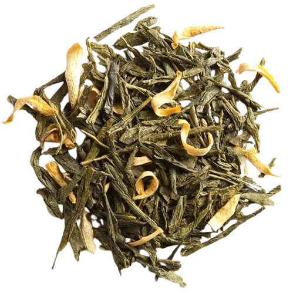

I recently tried Thé des Alizés, a tea blend from Palais des Thés. Here's my detailed review of the experience:

Preparation:

- **Temperature:** 170°F / 76°C
- **Time:** 0 min, 30 sec
- **Tea Amount:** 5 g
- **Water Volume:** 4 oz / 120 ml

## Overview

### 1st Infusion:

A very similar profile to their Thé du Louvre. When hot, this tea is much more subtle, but the flavors are extremely superficial, and just like the Thé du Louvre, there’s a slight acidity that lingers in the aftertaste.

### 2nd Infusion:

Hot, this tea now keeps this acidity. It’s not as bad as Thé du Louvre, but it’s definitely noticeable and I don’t get any of the white peach, kiwi, or watermelon. Although that could be the source of the acidity.

### 3rd Infusion:

Now the acidity, just like in the Thé du Louvre, has completely destroyed this tea. Nothing to get out of it, unfortunately. What a shame.

## Conclusion:

The Thé des Alizés fails to deliver the expected flavors of white peach, kiwi, or watermelon. The persistent acidity ruins the overall experience, making this tea blend highly disappointing.

Flavors: Acidic, Superficial

## Rating:

- **Flavor Complexity:** 8/30 - Very superficial flavors with dominant acidity.
- **Brewing Forgiveness:** 10/20 - Acidity persists and worsens over infusions.
- **Consistency Across Infusions:** 7/20 - Consistently disappointing across multiple steeps.
- **Overall Enjoyment:** 10/30 - Unpleasant due to persistent acidity.

# 35/100

*- yaro*
