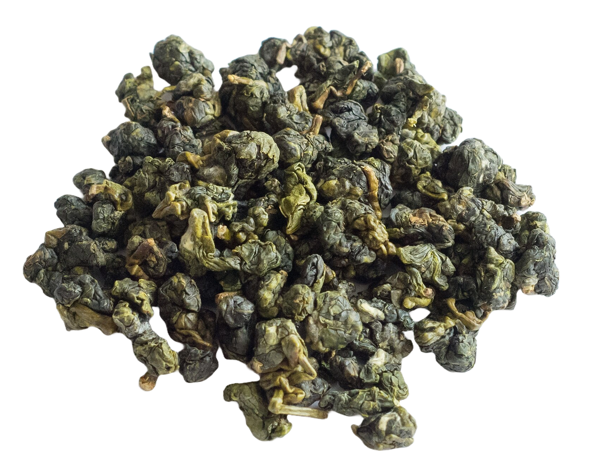

I recently went to visit [T's Teabar](https://tsteas.com/en-ae) in Abu Dhabi, I was excited to try a variety of their offerings, particularly the [Milky Oolong](https://en.wikipedia.org/wiki/Jin_Xuan_tea). My initial reaction was positive, but there were some surprising inconsistencies. Below are my thoughts on the teas I sampled, as well as feedback from friends who joined me for the second visit. 

## The shop itself

The shop itself is one of the most beautiful teashops I've seen in the entire region without a doubt, while it was somewhat empty when I went there (which could be explained by the fact that I went there on a Monday afternoon), the place makes for a great space to enjoy and share tea.

At the very center of the shop, itself located inside one of the older malls of Abu Dhabi, is a selection of around 30 teas. When opening one of the capsules imaged below, A plastic bag is found containing the tea itself. 100g at $30-$50, with a 100G **MINIMUM**, this is incomprehensible, thankfully the prices for in-house drinking are more than acceptable and it seems like their online prices are much, much more resonable and they start at 50g.

## Round 1
### Milky Oolong (First Infusion)

The tea had lacked a lot of definition, and after a **3-minute infusion**, the flavors slowly came through. While it was a bit watery, the little taste present was still somewhat refreshing. The expected milky notes were indeed present. I expected something more flavorful. But even after a longer **5-minute infusion**, the tea still hadn't released as much flavor as I had hoped. The water simply wasn’t hot enough (**80C**), leaving the tea tasting weak, almost like perfumed water.

Aerating the tea reveals an unpleasant surprise, hitting the top of the palate was a strange astringency we find in some Chinese greens, not [Oolongs](https://en.wikipedia.org/wiki/Oolong). Like a superficial mess, the taste goes all around my mouth without ever tongue without hitting any point significantly: no depth.

It’s unfortunate because this type of tea has so much potential. I’m confident it could be a favorite with better preparation. And it seems from what was told by the staff that it is the one that is the most popular.

My belief is that the constant opening and closing of the tea as well as the somewhat improper storage method could lead to a decreased depth in taste. This is a complaint I address to all tea shops without distinction, but this was an especially saddening case because the overall profile of the tea suggested an ability to show even deeper flavor.

## Round 2

### Milky Oolong (Second Infusion)

After consulting with friends and returning later that day, I decided to give the Milky Oolong another shot. This time, I asked for the water temperature to be raised to **90C** and I infused it for 3min, and while it improved slightly, the water still seemed too hard. The flavor was more pronounced, with a lingering aftertaste, but it remained too light and watery. The green tea bitterness, still present, overshadowed the experience. The issue is thus really in the tea itself rather than preparation it seems.

### **Berry Tea**

No dimension in the tea. The front taste is too artificial.
This tea was extremely disappointing. It tasted like an overly sweet, artificial supermarket red fruits tea. There was no depth, and the aftertaste was almost pungent, even after I tried airing the tea. After a **3-minute infusion**, I was left with a strongly concentrated, artificial flavor. For about $6, this was the most artificial-tasting tea I’ve ever had in a teahouse, I'd much rather add $2 and get something from [TWG](https://skoomaden.me/posts/review-of-twg-breakfast-teas/). It was overly strong and tasted like hard water. Simply put, it was **not good**.

### [Moroccan tea](https://blog.theteakitchen.com/tea-history-culture/the-history-of-moroccan-tea/)

The [Moroccan tea](https://blog.theteakitchen.com/tea-history-culture/the-history-of-moroccan-tea/) had a familiar wild mint taste, but it was too diluted. Instead of the usual [Gunpowder Green Tea](https://en.wikipedia.org/wiki/Gunpowder_tea), they used a different, difficult to identify green tea. They served it with honey, but it was too concentrated to bring out any real flavor and it ended up overpowering my first cup (which arguably, is my fault). Despite this, it was the only tea with a somewhat defined taste, though the bitterness was poorly managed. It felt like a tea-bag [Moroccan tea](https://blog.theteakitchen.com/tea-history-culture/the-history-of-moroccan-tea/), with a correct presentation but not round enough of a flavor.

## Conclusion

[T's Teabar](https://tsteas.com/en-ae) offers a mixed experience. The teas, particularly the [Milky Oolong](https://en.wikipedia.org/wiki/Jin_Xuan_tea), have potential but suffer from poor preparation. The lower water temperature and hard water negatively impacted the flavors, and the **Berry Tea** was disappointingly artificial. The [Moroccan tea](https://blog.theteakitchen.com/tea-history-culture/the-history-of-moroccan-tea/) had promise, but again, missed the mark in its execution.

Overall, [T's Teabar](https://tsteas.com/en-ae) seems to be a work in progress. However, with better preparation and attention to tea storage, I believe some of their teas could shine. Until then, I hope I'll come back with what great news about change in the establishment.

Thanks for reading!

*- yaro*
