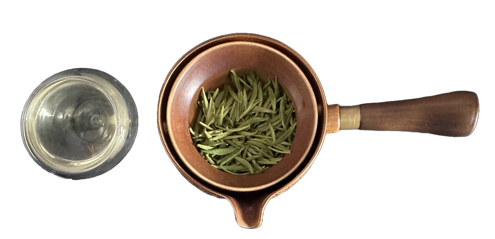

Today, My Chinese neighbour that knows I happen to love tea very much gifted me this very fresh and young green tea he got.

.png>)

He says since he was gifted that tea as well, he simply had no idea the region it came from, or even how old it is.

After asking the very knowledgable folk at [CommuniTEA](https://discord.com/invite/tea), they told me it was probably a Zhu Ye Qing, since it's bud only and it has a pretty generic tippy look.

## Wash and Apprehensions

Without going any further, I'd say it's very probable that this is a young tea, smell-wise it has that characteristic vegetal smell, not unlike some young puers.

Now let us see what this tea tastes like:

We're going for 80C, 50g, in my [rotating gaiwan thing](https://www.aliexpress.us/item/3256804874557813.html?spm=a2g0o.productlist.main.13.237eStxvStxv4D&algo_pvid=e8101cc9-9ddf-423c-84fd-fa6269e640fd&algo_exp_id=e8101cc9-9ddf-423c-84fd-fa6269e640fd-6&pdp_npi=4%40dis%21USD%2116.28%218.28%21%21%2116.28%218.28%21%402103244417179457814923364e01f3%2112000031487695724%21sea%21US%210%21AB&curPageLogUid=WSASrGLUWghL&utparam-url=scene%3Asearch%7Cquery_from%3A).

10s Wash

### 1st Steep (85C, 10s):

Since we're going very light on the steeps, this is gonna be a very progressive adventure (I don't have much of this tea and I wanna enjoy it fully as much as possible).

Unsuprisingly, this is very light, and it doesn't seem to show any particular traits that would diffentiate it from very bud-only green teas we know, still it's very pleasant.

### 2nd Steep (85C, 15s):

We start seeing the green arrive, albeit very slowly this is almost transparent.
Still light, but delightfully round. No bitterness to be seen, but as always with these young teas, they start bitting back from the 4th steep onwards.

### 3rd Steep (85C, 20s):

Very boring, very generic, it's like I'm waiting for the taste to come.
And I'm not a very patient man, let's get to 30s.

### 4th Steep (85C, 30s):

I mean it really doesn't look like it's going anywhere.
Looking at the leaves I don't think I've ever seen a green tea look like it isn't opening up this much.

Nothing of particular note,
So we're going for 45s.

## 5th Steep (85C, 45s):

Nothing at all, a subpar green tea, with almost nothing coming out of it.

## Overall Impression 

In conclusion this is an unfortunately too light green tea, which is suprising for its age too.
I can appreciate it isn't bitter at all as I thought it would develop through steeping, but it's perhaps too boring and round for my taste.

## Rating:

- **Flavor Complexity:** 0/30 - The tea lacked distinctive or exceptional flavors.
- **Brewing Forgiveness:** 20/20 - The tea's flavor did not evolve significantly with different steeping times.
- **Consistency Across Infusions:** 20/20 - The tea was always consistent, which in this case could be as much of a bad thing as it is a good thing.
- **Overall Enjoyment:** 5/30 - The tea was very round and light, but the lack of complexity makes it deeply unexciting.

# 45/100

*- yaro*
