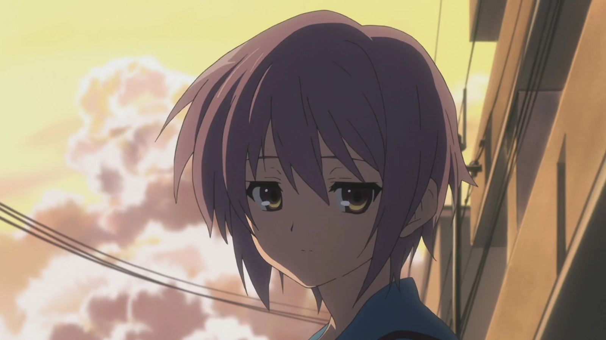

L'air chaud d'un été japonais sous le nez, l'ennui plein les chaussettes, la jeune Haruhi force comme à son habitude son groupe à sortir dehors — activités en plein air, piscines bondées, festivals, feux d'artifice... tout est bon pour occuper ses journées. Mais ce que Haruhi ignore, c’est qu’en cherchant à fuir l'ennui à tout prix, elle a piégé ses amis, et elle-même, dans une boucle temporelle sans fin.

Cet arc, connu sous le nom d'[Endless Eight](https://haruhi.fandom.com/wiki/Endless_Eight_I), est sans doute l’un des plus controversés de la série The Melancholy of Haruhi Suzumiya. À sa sortie, il a suscité la frustration et la colère des fans. Pourquoi répéter huit fois la même histoire avec si peu de différences, se demandaient-ils ? Mais ce que beaucoup n’ont pas vu, c’est que cette répétition n’était pas une erreur ou une paresse narrative. <mark>C'était une œuvre de génie, une expérience immersive qui, comme les personnages, nous plonge dans la monotonie et l’impuissance d’une boucle sans fin.</mark>

Dans cet article, je vais défendre l'idée que [Endless Eight](https://haruhi.fandom.com/wiki/Endless_Eight_I) n'était pas simplement une erreur de parcours dans l'anime, mais un choix narratif brillant, une réflexion profonde sur l’ennui, le temps et le libre arbitre. Si nous prenons le temps de décortiquer cette boucle temporelle, nous verrons qu’elle révèle beaucoup sur les personnages, notamment sur Haruhi, Kyon et surtout Yuki Nagato, et offre une expérience unique tant sur le plan psychologique qu’esthétique.

## I. La Répétition comme Expérience Sensorielle

Les mêmes scènes répétées incessament, <mark>un cycle infini que Haruhi ne peut pas sentir, mais que Kyon et nous, spectateurs, ressentons jusqu’à la lassitude.</mark> Chaque jour semble identique, chaque épisode nous emprisonne avec eux dans cette boucle. Pourtant, au fil des épisodes, des détails discrets émergent — un vêtement changé, un angle légèrement différent — des variations qui, loin d’être insignifiantes, deviennent vitales. Ces infimes différences captent notre attention, nous forçant à saisir l’invisible dans l’immuable.

Les variations d’un épisode à l’autre ne sont autant là pour nous frustrer, que pour nous faire comprendre que dans chaque répétition réside une micro-évolution. C’est à force de revivre la même journée que ces petites différences commencent à apparaître, et soudain, elles prennent toute leur importance. C’est comme un hommage à la routine humaine : même dans le plus répétitif, il y a des subtilités, des changements imperceptibles. La série nous pousse à réévaluer ce que nous croyons savoir du quotidien.

Yuki, elle, incarne l’essence même de cette répétition. En tant que témoin des 15 532 boucles, elle voit tout, elle se souvient de tout. Sa conscience omniprésente devient un fardeau qu’elle porte en silence. Si les autres oublient à chaque nouveau cycle, <mark>Yuki reste la seule à vivre la répétition dans toute sa douleur.</mark> Son regard vide, sa posture figée, témoignent d’une fatigue émotionnelle qui ne peut être soulagée que par une rupture avec cette éternelle stagnation.

## II. Temps Figé et Montée de l'Ennui

Chaque jour est une variation de la précédente -- Bien que les événements semblent identiques, la série introduit des différences subtiles : des vêtements changent, les dialogues varient légèrement, les angles de caméra sont repensés. Ces modifications, bien que mineures, poussent les personnages à prêter attention aux détails de leur environnement. Ils commencent à se rendre compte que quelque chose ne va pas, que le temps n’avance plus réellement,<mark> et c’est cette prise de conscience qui amorce le désir de rupture.</mark>

À mesure que les épisodes se répètent, l’ennui devient palpable. Ce n’est pas un simple inconfort passager : il devient une force grandissante qui pousse Kyon et les autres à chercher un moyen de sortir de la boucle. La lassitude les pousse à réagir, à essayer de trouver ce qui manque ou ce qu’ils ont négligé. Plus l’ennui croît, plus leur frustration devient un moteur, les incitant à réfléchir aux petites actions ou aux événements non réalisés, les guidant vers une possible solution.

Ce processus atteint son paroxysme lorsque Kyon réalise que la solution ne réside pas dans un acte spectaculaire ou complexe, mais dans une action simple : faire les devoirs d’été, une tâche banale qu’ils avaient évitée. En prenant cette décision, il rompt finalement la boucle. <mark>Ce choix met en lumière l’idée que, parfois, ce sont les gestes les plus ordinaires, souvent dédaignés, qui contiennent la clé de la libération.</mark> Le temps, figé par l’ennui, reprend son cours grâce à cette prise de conscience, libérant les personnages d'une répétition sans fin.

## III. La Dichotomie Haruhi/Yuki

L’impuissance face au temps et l’illusion de la liberté
Dans [Endless Eight](https://haruhi.fandom.com/wiki/Endless_Eight_I), les personnages sont piégés dans une boucle où toute tentative de changement échoue. Yuki représente la réalité lucide, subissant chaque itération avec une conscience douloureuse de la répétition, incarnant la souffrance d’une existence immuable. À l’opposé, <mark>Haruhi incarne l’illusion et l’ennui : malgré ses pouvoirs, elle tente de fuir la banalité en générant la boucle, sans comprendre qu’elle en est la cause.</mark>

Haruhi est dominée par l’ennui existentiel, créant inconsciemment une boucle pour échapper à la monotonie. Ce mécanisme inconscient reflète une quête insatiable de nouveauté qui, paradoxalement, se transforme en stagnation. À l’opposé, Yuki supporte stoïquement la boucle, incarnant la souffrance face à une réalité où chaque cycle se répète sans variation significative. Cette dynamique entre Haruhi et Yuki met en lumière l’éternel balancement entre l’illusion d’un monde que l’on cherche à fuir et la souffrance d’une réalité que l’on doit affronter.

Au centre de cette dichotomie, Kyon se situe entre ces deux pôles. Sa frustration grandissante et son incapacité à briser la boucle reflètent une lutte contre l’impuissance face au temps. Cependant, c’est par une action simple et réfléchie que Kyon finit par briser la répétition. En acceptant une solution banale (faire les devoirs d’été), il réalise que la rupture du cycle ne réside pas dans des actions grandioses, mais dans la reconnaissance des petites décisions. Cela montre que même face à l’ennui et à la souffrance, la liberté peut s’exprimer dans des gestes simples, mais significatifs.

<mark>La force de [Endless Eight](https://haruhi.fandom.com/wiki/Endless_Eight_I) réside dans cette opposition fondamentale entre l’illusion et la réalité, l’ennui et la souffrance.</mark> Haruhi cherche sans cesse à échapper à la banalité, mais son ennui perpétuel l’enferme dans une boucle. Yuki, quant à elle, supporte la réalité pour ce qu’elle est, mais à un coût émotionnel lourd. Cet arc montre que la libération de ces forces antagonistes réside dans la prise de conscience et l’acceptation des choix simples, incarnée par Kyon.

## Conclusion

[Endless Eight](https://haruhi.fandom.com/wiki/Endless_Eight_I) a indéniablement frustré une grande partie de son audience, mais c'est précisément là que réside sa réussite. [Kyoto Animation](https://en.wikipedia.org/wiki/Kyoto_Animation) a sciemment décidé de forcer le spectateur à ressentir l'ennui, la répétition et la stagnation en utilisant une technique rarement vue dans l’animation. En cela, [Endless Eight](https://haruhi.fandom.com/wiki/Endless_Eight_I) a atteint son objectif : faire vivre au spectateur la même expérience que les personnages, en particulier Kyon et Yuki, prisonniers d’une boucle temporelle sans issue apparente.

Les réactions des fans reflètent cette réussite. Beaucoup ont exprimé leur colère et leur frustration face à la répétition des épisodes, avec peu de différences d'une semaine à l'autre, certains se sentant manipulés par [Kyoto Animation](https://en.wikipedia.org/wiki/Kyoto_Animation). D'autres, plus tard, ont fini par reconnaître l'audace de la série, soulignant que ces huit épisodes sont une véritable prouesse technique. Les changements subtils de cadrage, de mise en scène, et de dialogues ajoutent une richesse que seuls les spectateurs les plus attentifs peuvent apprécier.

[Kyoto Animation](https://en.wikipedia.org/wiki/Kyoto_Animation) a également employé des techniques visuelles sophistiquées pour renforcer l’immersion : Haruhi est souvent cadrée de manière imposante, incarnant son contrôle du temps, tandis que Yuki, à travers des plans introspectifs et silencieux, exprime sa lassitude. Les motifs visuels récurrents, comme les cigales et les variations subtiles dans les épisodes, poussent le spectateur à chercher les micro-évolutions dans ce cycle infini.

En créant cette frustration chez le public, <mark>[Endless Eight](https://haruhi.fandom.com/wiki/Endless_Eight_I) brise les attentes traditionnelles et transforme l'ennui en un outil narratif</mark>, amenant le spectateur à explorer les limites du quotidien et de la répétition.

<mark>- yaro</mark>