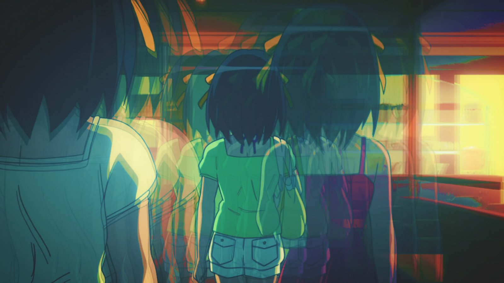

La chaleur accablante d’un été japonais sous son nez, l’ennui dans ses chaussettes, la jeune Haruhi, comme à son habitude, force son groupe à sortir — des activités en plein air, des piscines bondées, des festivals, des feux d’artifice... tout est bon pour occuper ses journées. Mais ce qu’Haruhi ne sait pas, c’est qu’en essayant d’échapper à l’ennui à tout prix, elle a piégé ses amis, et elle-même, dans une boucle temporelle sans fin.

L'arc *Endless Eight* de *La Mélancolie de Haruhi Suzumiya* reste l'une des histoires les plus polarisantes de l'anime. Sa structure répétitive frustre et défie le public, mais sous cette surface se trouve une riche exploration psychologique de deux expériences opposées : la souffrance passive de Yuki Nagato due à sa conscience et l'ennui agité de Haruhi Suzumiya, enraciné dans l'ignorance. À travers des visuels soigneusement construits et des changements subtils à chaque épisode, Kyoto Animation (KyoAni) nous immerge dans les fardeaux psychologiques que portent ces personnages.

## La Souffrance de Yuki : Stase et Répétition

Yuki Nagato est la seule à se souvenir de chacune des 15 532 itérations de la boucle temporelle. <mark>Son monde intérieur est façonné par cette conscience sans fin, menant à un état de souffrance passive.</mark> Elle porte le poids de cette connaissance en silence, un fardeau psychologique que KyoAni capture à travers la tranquillité visuelle et la répétition.

### Position Statique et Stase Visuelle

Yuki est souvent montrée assise tranquillement en arrière-plan, détachée des activités estivales du groupe. Sa posture et sa position restent statiques d'un épisode à l'autre, mettant en évidence sa résignation face à l'inutilité de la boucle. Les subtils changements de sa position rappellent au spectateur qu'elle est consciente de chaque petit changement, sans toutefois avoir le pouvoir d'agir. <mark>Elle est pleinement consciente de l'inutilité de la boucle, mais elle n'a pas la capacité de la changer, reflétant l'état psychologique de quelqu'un piégé par la connaissance sans possibilité d'agir.</mark>

### Les Palettes de Couleurs Atténuées Reflètent l'Érosion Émotionnelle

Au fur et à mesure que les épisodes avancent, les couleurs deviennent de plus en plus ternes et fades, notamment dans les scènes impliquant Yuki. Les tons vibrants de l'été qui remplissaient autrefois l'écran se dégradent lentement, reflétant l'épuisement émotionnel de Yuki. <mark>Cette détérioration visuelle reflète l'érosion de son monde intérieur alors qu'elle continue à vivre les mêmes événements encore et encore.</mark> Lorsque le public remarque ce changement, il commence lui aussi à ressentir la même lassitude que Yuki.

## L'Ennui de Haruhi : Énergie Agitée Sans Compréhension

Contrairement à la souffrance silencieuse de Yuki, Haruhi Suzumiya incarne une lutte psychologique différente : la frustration de l'ennui. <mark>L'énergie agitée de Haruhi la pousse à chercher constamment de nouvelles expériences, mais son ignorance de la boucle temporelle la piège dans un cycle d'activités répétitives.</mark> KyoAni capture cette tension psychologique à travers l'énergie incessante de Haruhi et le rythme effréné des sorties estivales du groupe.

### Représentation Visuelle Dynamique de l'Énergie de Haruhi

Le mouvement constant de Haruhi est représenté visuellement par des mouvements de caméra rapides et des coupes brusques, reflétant sa quête incessante de nouveauté. Cependant, son énergie est un piège en soi — elle reste aveugle à la répétition de la boucle, répétant les mêmes activités sans s'en rendre compte. <mark>Son incapacité à percevoir la boucle la piège dans un cycle de désirs insatisfaits.</mark> Cette énergie dynamique contraste fortement avec l'immobilité de Yuki, mettant en lumière les états psychologiques respectifs des personnages.

### Cycles de Jour et de Nuit : Agitation contre Souffrance

KyoAni utilise le cycle jour-nuit pour renforcer le contraste psychologique entre Haruhi et Yuki. Les scènes lumineuses et actives de la journée reflètent la recherche de stimulation par Haruhi, tandis que les moments plus calmes et sombres de la nuit soulignent la souffrance silencieuse de Yuki. <mark>Tandis que Haruhi cherche la stimulation pendant la journée, la nuit signale le retour du poids psychologique que Yuki porte.</mark> Ces indices visuels alternants mettent en avant les expériences contrastées des deux personnages.

## Variations Subtiles : Une Métaphore des Pièges Psychologiques

Les petites différences entre chaque épisode servent de métaphore pour l'emprisonnement psychologique des personnages. <mark>Tandis que Haruhi continue à s'engager dans les mêmes activités sans remarquer la boucle, Yuki est douloureusement consciente de chaque petite variation.</mark> Ces petits changements — une modification dans le dialogue, une tenue différente ou une nouvelle activité — reflètent l'inutilité de la conscience de Yuki et l'ignorance de Haruhi.

### Les Détails Mineurs Soulignent l'Inutilité

Yuki remarque chaque petit changement, mais ces détails n'apportent aucun réconfort. Chaque variation représente un moment de différence fugace, mais renforce finalement le même résultat. <mark>Cet écart de conscience alimente la souffrance des deux personnages — le désespoir conscient de Yuki et l'agitation insatisfaite de Haruhi.</mark>

### La Répétition Comme Métaphore Psychologique

Les visuels et les activités répétées deviennent une métaphore puissante pour l'emprisonnement de Yuki dans la conscience et le piège de l'ignorance de Haruhi. Le public est également entraîné dans cette répétition, partageant la frustration des personnages. <mark>La répétition sans fin devient une prison psychologique pour Yuki et un cycle d'ignorance pour Haruhi, écho des expériences humaines plus larges de stase et de quête inassouvie.</mark>

## Préparer le Terrain pour *La Disparition de Haruhi Suzumiya*

L'arc *Endless Eight* ne sert pas seulement d'expérience narrative, mais aussi de base psychologique pour *La Disparition de Haruhi Suzumiya*. <mark>La boucle implacable prépare le public à comprendre le point de rupture émotionnel et mental de Yuki, ouvrant la voie à sa décision finale de modifier la réalité dans *Disparition*.</mark>

### Libération Visuelle et Psychologique dans *Disparition*

Le passage de l'été sans fin de *Endless Eight* à l'hiver serein de *La Disparition de Haruhi Suzumiya* marque une libération visuelle et émotionnelle pour Yuki et le public. Les activités oppressantes et répétitives de l'été cèdent la place à un monde calme et tranquille, symbolisant l'évasion de Yuki de la boucle. <mark>Après avoir enduré d'innombrables répétitions, la décision de Yuki de se libérer semble à la fois inévitable et émotionnellement cathartique.</mark>

## Conclusion : Une Exploration Psychanalytique de la Souffrance et de l'Ennui

*Endless Eight* est une étude psychanalytique de deux personnages pris dans des luttes psychologiques contrastées. <mark>Yuki, accablée par sa connaissance de la boucle, souffre en silence, tandis que Haruhi, poussée par un besoin insatiable d'excitation, reste inconsciente du cycle qui la retient.</mark> Les indices visuels subtils de KyoAni et la structure répétitive de l'arc immergent le public dans leurs luttes respectives, nous entraînant dans la résignation de Yuki et la quête agitée de nouveauté par Haruhi.

Cette montée en tension nous prépare à la libération émotionnelle dans *La Disparition de Haruhi Suzumiya*, où Yuki prend enfin le contrôle de son destin. Ainsi, *Endless Eight* sert d'étude psychologique profonde de la souffrance et de l'ennui, reflétant les défis de la conscience humaine à travers une expérience narrative unique.
