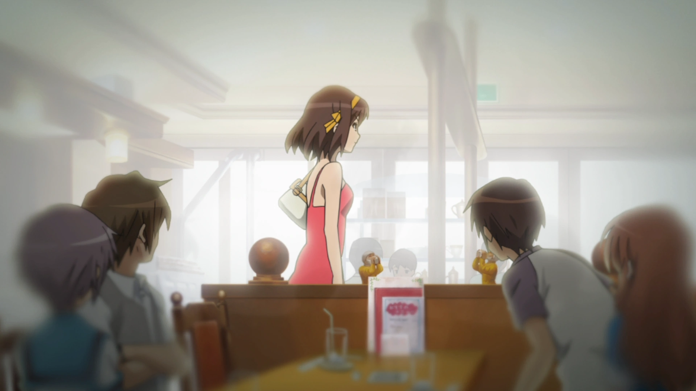
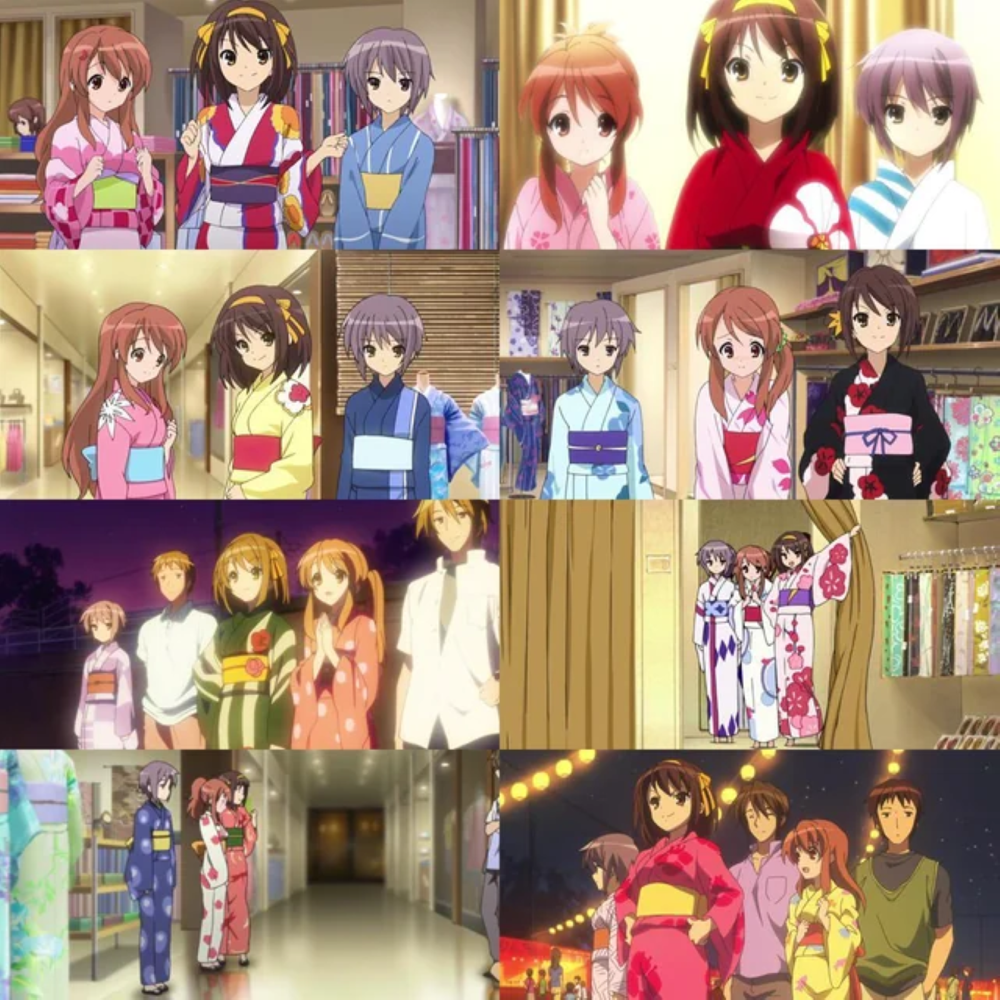

La chaleur accablante d’un été japonais sous son nez, l’ennui dans ses chaussettes, la jeune Haruhi, comme à son habitude, force son groupe à sortir — des activités en plein air, des piscines bondées, des festivals, des feux d’artifice... tout est bon pour occuper ses journées. Mais ce qu’Haruhi ne sait pas, c’est qu’en essayant d’échapper à l’ennui à tout prix, elle a piégé ses amis, et elle-même, dans une boucle temporelle sans fin.

L’arc *Endless Eight* de *La Mélancolie de Haruhi Suzumiya* reste l'une des histoires les plus polarisantes de l’animation. Sa structure répétitive frustre et défie le public, mais sous cette surface se cache une riche exploration psychologique de deux expériences opposées : la souffrance passive de Yuki Nagato, consciente de la situation, et l’ennui agité d’Haruhi Suzumiya, enraciné dans l’ignorance. À travers des visuels soigneusement construits et des variations subtiles dans chaque épisode, Kyoto Animation (KyoAni) nous plonge dans les fardeaux psychologiques que portent ces personnages.

## La Souffrance de Yuki : Stase et Répétition

Yuki Nagato est le seul personnage qui se souvient de chacune des 15 532 itérations de la boucle temporelle. <mark>Son monde intérieur est façonné par cette conscience incessante, ce qui la conduit à un état de souffrance passive.</mark> Yuki ne se rebelle pas ; elle porte ce fardeau en silence, une souffrance psychologique que KyoAni capture à travers la fixité visuelle et la répétition.

### Positionnement Constant dans les Cadres

Yuki est souvent montrée assise silencieusement en arrière-plan, observant le groupe participer aux activités estivales familières. Sa position change rarement, et son expression reste impassible, reflétant sa résignation. Les légers changements dans sa posture au fil des épisodes, combinés à des cadrages statiques, mettent en évidence son désespoir intériorisé. <mark>Elle est pleinement consciente de l’inutilité de la boucle, mais elle n’a pas le pouvoir de la changer, reflétant l’état psychologique de quelqu’un piégé par la connaissance sans la capacité d’agir.</mark>

### Stase Visuelle vs. Changement Dynamique

Alors que Yuki est immobile et passive, le reste du groupe—Haruhi, Kyon et les autres—participe à des activités estivales énergiques. Les petites variations entre les épisodes, comme de légères différences dans les vêtements ou les dialogues, représentent les changements mineurs que Yuki remarque, mais ils ne modifient finalement pas l’issue. <mark>Cette dynamique entre sa stase interne et l’activité du groupe souligne sa souffrance psychologique—elle perçoit les moindres détails, mais ils ne changent pas la réalité cyclique qu’elle endure.</mark>

### Utilisation de Palettes de Couleurs Fades et Ternes

Au fur et à mesure que les épisodes avancent, les couleurs deviennent de plus en plus ternes, notamment dans les scènes impliquant Yuki. Les couleurs vives et joyeuses de l’été se dégradent lentement, reflétant l’épuisement émotionnel de Yuki. <mark>Cette détérioration visuelle reflète l’érosion de son monde intérieur alors qu’elle continue de vivre les mêmes événements encore et encore.</mark> Le public, lui aussi, commence à ressentir cette lassitude, miroir de l’état mental de Yuki, renforçant ainsi notre connexion avec sa détresse.

## L’Ennui d’Haruhi : Énergie Frénétique sans Compréhension

En contraste avec la souffrance silencieuse de Yuki, Haruhi Suzumiya incarne une autre forme de lutte psychologique : la frustration de l’ennui. <mark>L’énergie frénétique d’Haruhi la pousse à chercher constamment de nouvelles expériences, mais son ignorance de la boucle temporelle la laisse piégée dans un cycle d’activités répétitives.</mark> KyoAni capture cette dynamique psychologique à travers les mouvements frénétiques d’Haruhi et le rythme effréné des sorties estivales du groupe.

### Contrastes dans la Présence Visuelle d’Haruhi

Haruhi est constamment en mouvement, qu’elle soit en train d’organiser une sortie pour un festival ou de planifier la prochaine activité de groupe. Cette énergie est visuellement représentée par des mouvements de caméra dynamiques, des coupes rapides et un éclairage vif. Haruhi pousse toujours le groupe vers l’avant, mais <mark>son incapacité à percevoir la boucle la piège dans un cycle de désirs insatisfaits.</mark> Son dynamisme extérieur contraste avec l’immobilité de Yuki, soulignant la dualité de leurs états psychologiques respectifs—la quête extérieure d’Haruhi contre l’endurance intérieure de Yuki.

### Changements Visuels entre le Jour et la Nuit
L’utilisation par KyoAni du cycle jour-nuit accentue davantage l’agitation d’Haruhi et la souffrance de Yuki. Les scènes lumineuses et actives du jour reflètent la quête extérieure d’excitation d’Haruhi, tandis que les nuits plus sombres et calmes symbolisent le désespoir intérieur de Yuki. <mark>Alors qu’Haruhi recherche la stimulation pendant la journée, la nuit signale le retour du fardeau psychologique que Yuki porte.</mark> Ces indices visuels alternants renforcent la tension psychologique entre les deux personnages : la recherche de sens d’Haruhi et la connaissance silencieuse de Yuki quant à l’inutilité de la boucle.

## Variations Subtiles : Le Piège de la Répétition

Les petites différences, presque imperceptibles, entre chaque épisode servent de métaphore pour les états psychologiques des personnages. <mark>Alors qu’Haruhi continue de s’engager dans les mêmes activités sans remarquer la boucle, Yuki est douloureusement consciente de chaque légère variation.</mark> Ces variations subtiles—un changement dans les dialogues, une tenue ou le timing des événements—mettent en évidence le piège psychologique dans lequel sont pris les deux personnages.

### Différences dans les Détails pour Mettre en Évidence le Piège
Yuki remarque chaque petite variation, mais ces détails n’offrent aucun réconfort. La répétition des événements avec des différences mineures reflète l’expérience psychologique de quelqu’un piégé dans un cycle dont il ne peut s’échapper, conscient des changements mais incapable de s’en libérer. Haruhi, quant à elle, est aveugle à ces différences, poursuivant aveuglément la nouveauté sans réaliser qu’elle répète les mêmes actions. <mark>Cet écart de conscience alimente la souffrance des deux personnages—le désespoir conscient de Yuki et l’agitation insatisfaite d’Haruhi.</mark>

### Comment la Répétition Devient une Métaphore Psychologique
La répétition sans fin des mêmes visuels et activités devient une métaphore des états psychologiques de Yuki et Haruhi. Pour Yuki, la répétition est une prison—chaque cycle renforce sa résignation. Pour Haruhi, c’est un piège d’ignorance, car elle continue à chercher quelque chose de nouveau sans se rendre compte qu’elle est coincée dans une boucle. <mark>Le public, lui aussi, est entraîné dans cette répétition, éprouvant la même frustration que les personnages.</mark> Cette immersion nous prépare à la résolution émotionnelle dans *La Disparition de Haruhi Suzumiya*, où Yuki finit par prendre une décision décisive pour se libérer du cycle.

## Préparer le Terrain pour *La Disparition de Haruhi Suzumiya*

La répétition dans *Endless Eight* sert non seulement d’expérience narrative, mais aussi de préparation psychologique pour *La Disparition de Haruhi Suzumiya*. <mark>La boucle implacable prépare le public à comprendre le point de rupture émotionnel et mental de Yuki, mettant en scène sa décision ultime de modifier la réalité dans *Disparition*.</mark>

### Contraste entre Répétition et Libération dans *Disparition*

Le passage visuel de l’été sans fin de *Endless Eight* à l’hiver froid et serein de *Disparition* marque une libération psychologique tant pour Yuki que pour le public. Les activités estivales oppressantes cèdent la place à un monde de calme et de tranquillité, symbolisant la libération finale de Yuki de la boucle. <mark>Après avoir enduré d’innombrables répétitions, la décision de Yuki de se libérer semble à la fois inévitable et émotionnellement cathartique.</mark> Le changement visuel, des couleurs vives et dynamiques aux tons plus calmes et doux, reflète la résolution de son tourment intérieur.

## Conclusion : Une Exploration Psychanalytique d’*Endless Eight*

*Endless Eight* est une exploration psychanalytique de deux personnages piégés dans leurs propres luttes psychologiques. <mark>Yuki, accablée par sa connaissance de la boucle, souffre en silence, tandis qu’Haruhi, poussée par un besoin insatiable de stimulation, reste inconsciente du cycle qui la retient prisonnière.</mark> Grâce à des indices visuels subtils et à une répétition soigneusement orchestrée, KyoAni nous immerge dans les expériences psychologiques duales de ces personnages.

La souffrance intérieure de Yuki, représentée par l’immobilité et des couleurs ternes, contraste avec l’énergie agitée d’Haruhi et sa présence dynamique. Alors que la boucle continue, le public est entraîné dans leurs luttes respectives—la résignation de Yuki et la quête incessante de stimulation d’Haruhi. <mark>Cette montée en puissance nous prépare à la libération émotionnelle dans *La Disparition de Haruhi Suzumiya*, où Yuki brise enfin le cycle et prend le contrôle de son destin.</mark>

De cette façon, *Endless Eight* devient une étude psychologique profonde de la souffrance et de l’ennui, entraînant le spectateur dans les états mentaux de ses personnages et offrant une expérience narrative unique qui reflète les défis de la psyché humaine.

  <mark>- yaro</mark>