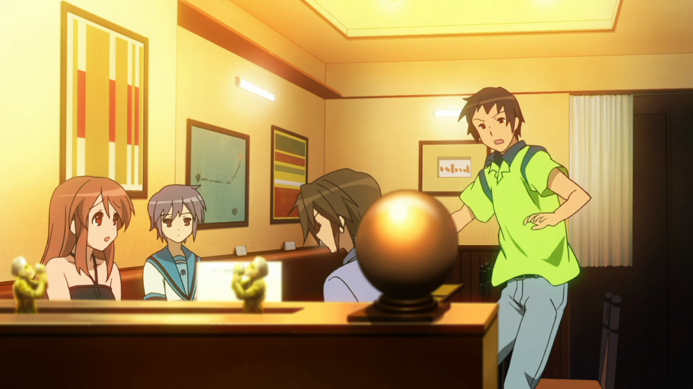

---  
title: "Suffering and Boredom: Endless Eight"  
date: 2024-10-16
tags: ['Multimedia', 'Animes']  
description: "The warm air of a never-ending Japanese summer."  
cover: "/covers/cover-haruhi.png"  
---

The warm air of a Japanese summer under her nose, boredom in her socks, young Haruhi, as usual, forces her group to go out — outdoor activities, crowded pools, festivals, fireworks... anything is good to fill her days. But what Haruhi doesn’t know is that in trying to escape boredom at all costs, she has trapped her friends, and herself, in an endless time loop.

The *Endless Eight* arc from *The Melancholy of Haruhi Suzumiya* remains one of the most polarizing stories in anime. Its repetitive structure frustrates and challenges the audience, but beneath this surface lies a rich psychological exploration of two opposing experiences: Yuki Nagato’s passive suffering from awareness and Haruhi Suzumiya’s restless boredom rooted in ignorance. Through carefully constructed visuals and subtle shifts in each episode, Kyoto Animation (KyoAni) immerses us in the psychological burdens these characters carry.

## Yuki’s Suffering: Stasis and Repetition

Yuki Nagato is the sole character who remembers each of the 15,532 iterations of the time loop. <mark>Her internal world is shaped by this unending awareness, leading to a state of passive suffering.</mark> Yuki doesn’t lash out; instead, she bears the weight of this knowledge in silence, a psychological burden that KyoAni captures through visual stillness and repetition.

### Constant Positioning in the Frames

Yuki is often shown sitting silently in the background, watching the group engage in familiar summer activities. Her position rarely changes, and her expression remains impassive, reflecting her resignation. The subtle shifts in her posture across episodes, combined with the static framing, highlight her internalized despair. <mark>She is fully aware of the loop’s futility but lacks the agency to change it, mirroring the psychological state of someone trapped by knowledge without the ability to act.</mark>

### Visual Stasis vs. Dynamic Change

While Yuki is still and passive, the rest of the group—Haruhi, Kyon, and others—are engaged in energetic summer activities. The small variations between episodes, such as slight differences in clothing or dialogue, represent the minor changes Yuki notices, but they ultimately do nothing to alter the outcome. <mark>This dynamic between her internal stasis and the group’s activity emphasizes her psychological suffering—she perceives the minor details, yet they don’t change the cyclical reality she endures.</mark>

### The Use of Dull and Muted Color Palettes

As the episodes progress, the colors become increasingly muted, especially in scenes involving Yuki. The bright, lively colors of summer slowly degrade, reflecting Yuki’s emotional exhaustion. <mark>This visual deterioration mirrors the erosion of her inner world as she continues to experience the same events over and over again.</mark> The audience, too, begins to feel this weariness, mirroring Yuki’s mental state and deepening our connection to her plight.

## Haruhi’s Boredom: Restless Energy Without Understanding

In contrast to Yuki’s quiet suffering, Haruhi Suzumiya embodies a different kind of psychological struggle: the frustration of boredom. <mark>Haruhi’s restless energy drives her to constantly seek new experiences, but her ignorance of the time loop leaves her trapped in a cycle of repetitive activities.</mark> KyoAni captures this psychological dynamic through Haruhi’s frantic movements and the relentless pace of the group’s summer outings.

### Contrasts in Haruhi’s Visual Presence

Haruhi is in constant motion, whether she’s organizing a festival outing or planning the next group activity. This energy is visually represented through sharp camera movements, quick cuts, and bright lighting. Haruhi is always pushing the group forward, but <mark>her inability to perceive the loop traps her in a cycle of unsatisfied desires.</mark> Her external dynamism contrasts with Yuki’s stillness, highlighting the dual nature of their respective psychological states—Haruhi’s outward drive versus Yuki’s internal endurance.

### Visual Shifts Between Day and Night
KyoAni’s use of the day-night cycle further emphasizes Haruhi’s restlessness and Yuki’s suffering. The bright, active daytime scenes reflect Haruhi’s outward pursuit of excitement, while the darker, quieter nights represent Yuki’s internal despair. <mark>As Haruhi seeks stimulation during the day, the night signals the return of the psychological weight Yuki carries.</mark> These alternating visual cues reinforce the psychological tension between the two characters: Haruhi’s search for meaning and Yuki’s silent knowledge of the loop’s futility.

## Subtle Variations: The Trap of Repetition

The small, almost imperceptible differences between each episode serve as a metaphor for the characters’ psychological states. <mark>While Haruhi continues to engage in the same activities without noticing the loop, Yuki is painfully aware of every slight variation.</mark> These subtle shifts—a change in dialogue, an outfit, or the timing of events—highlight the psychological trap both characters are caught in.

### Differences in Details to Highlight the Trap
Yuki notices every small variation, but these details offer no solace. The repetition of events with minor differences mirrors the psychological experience of someone trapped in a cycle they cannot escape, aware of the changes but unable to break free. Haruhi, on the other hand, is oblivious to these differences, blindly pursuing novelty without realizing she’s repeating the same actions. <mark>This gap in awareness drives both characters’ suffering—Yuki’s knowing despair and Haruhi’s unfulfilled restlessness.</mark>

### How Repetition Becomes a Psychological Metaphor
The endless repetition of the same visuals and activities becomes a metaphor for both Yuki and Haruhi’s psychological states. For Yuki, the repetition is a prison—each cycle reinforces her resignation. For Haruhi, it’s a trap of ignorance, as she continues searching for something new without realizing she’s stuck in a loop. <mark>The audience, too, is drawn into this repetition, experiencing the same frustration as the characters.</mark> This immersion prepares us for the emotional resolution in *The Disappearance of Haruhi Suzumiya*, where Yuki finally makes a decisive move to break free from the cycle.

## Setting the Stage for *The Disappearance of Haruhi Suzumiya*

The repetition in *Endless Eight* serves not only as a narrative experiment but as a psychological buildup to *The Disappearance of Haruhi Suzumiya*. <mark>The relentless loop primes the audience to understand Yuki’s emotional and mental breaking point, setting the stage for her eventual decision to alter reality in *Disappearance*.</mark>

### Contrast Between Repetition and Release in *Disappearance*

The visual shift from the endless summer of *Endless Eight* to the cold, serene winter of *Disappearance* marks a psychological release for both Yuki and the audience. The oppressive summer activities give way to a world of stillness and quiet, symbolizing Yuki’s final escape from the loop. <mark>After enduring countless repetitions, Yuki’s decision to break free feels both inevitable and emotionally cathartic.</mark> The shift in visuals, from bright and dynamic to muted and calm, reflects the resolution of her internal turmoil.

## Conclusion: A Psychoanalytical Exploration of *Endless Eight*

*Endless Eight* is a psychoanalytical exploration of two characters trapped in their own psychological struggles. <mark>Yuki, burdened by her knowledge of the loop, suffers silently, while Haruhi, driven by an insatiable need for excitement, remains oblivious to the cycle that holds her.</mark> Through subtle visual cues and carefully crafted repetition, KyoAni immerses us in the dual psychological experiences of these characters.

Yuki’s internal suffering, represented through stillness and muted colors, contrasts with Haruhi’s restless energy and dynamic presence. As the loop continues, the audience is drawn into their respective struggles—Yuki’s resignation and Haruhi’s endless search for stimulation. <mark>This buildup primes us for the emotional release in *The Disappearance of Haruhi Suzumiya*, where Yuki finally breaks the cycle and takes control of her fate.</mark>

In this way, *Endless Eight* serves as a deep psychological study of suffering and boredom, drawing the viewer into the mental states of its characters and offering a unique narrative experience that mirrors the challenges of the human psyche.

  <mark>- yaro</mark>