Alright, you guys hold on tight because this is gonna be a long one.

white2tea recently updated their tea linups with teas that as always, we should not judge by their oh so beautiful covers, even if it is incredibly hard.

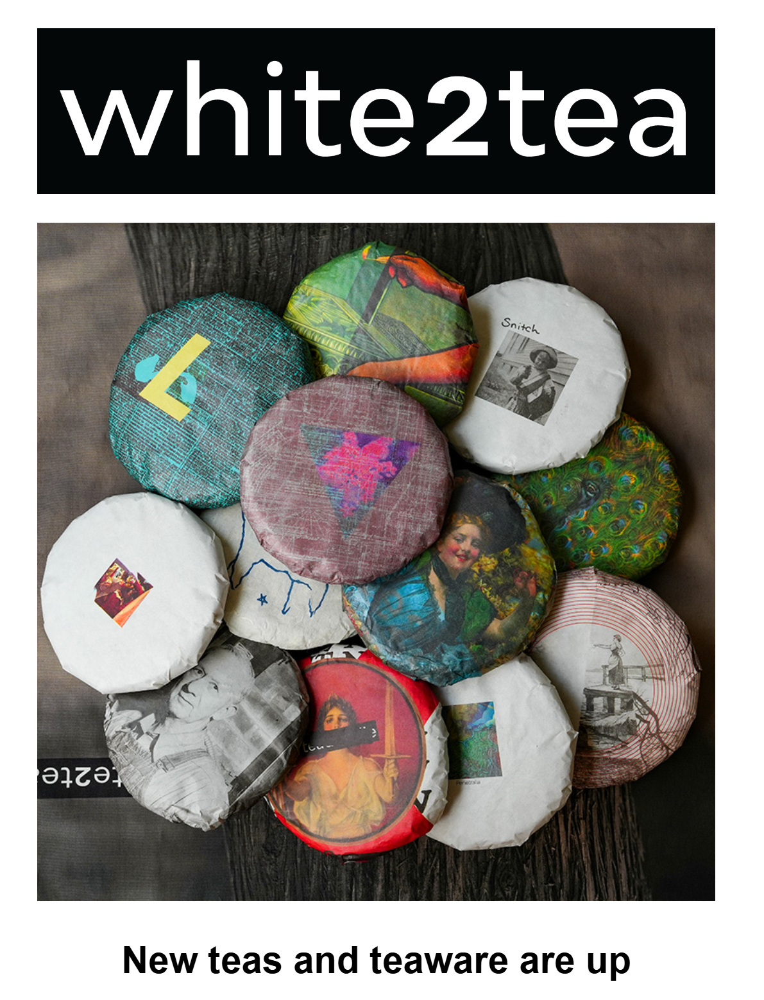

This happened right after I reviewed the [2024 Great Blue Heron Minis](https://skoomaden.me/posts/review-of-2024-great-blue-heron-by-white2tea/) and the [2021 Sunskate](https://skoomaden.me/posts/review-of-2021-sunskate-by-white2tea/).
 
 I realized I needed to get myself not only some more teas to try, but in more digestible formats, to make sure I can review as many teas as I possibly could.
 And white2tea just offered my the biggest excuse to finally do an order full of the new minis (and a few older extras) !

## Let the credit card RIP.

Okay okay, maybe I overdid it.
Not only did I order two Philtre Minis by mistake 😭 but I hadn't realized things had gotten this out of hand price-wise.

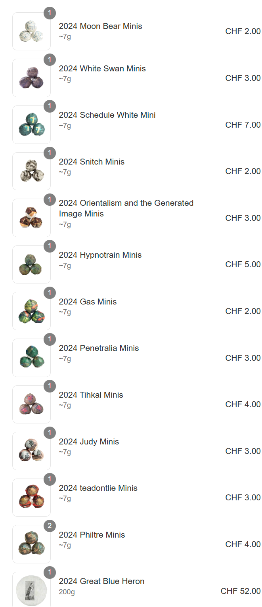

That being said, I'm overall glad, got so many teas, I cannot wait for the Den to be filled with new scents and for new eyes to read these reviews !

Alright, this is supposed to be haul, so let's get started.

## 2024 White Swans Minis -- Maochas, maochas, maochas...

White2Tea describes this as a "blended pressing of aged 2014 maocha from the white2tea vault for the Puer lovers seeking a balance of quality, value and immediate drinkability. This dry aged blend has succulent huigan and mid-aged character that is on its way to smoothness".

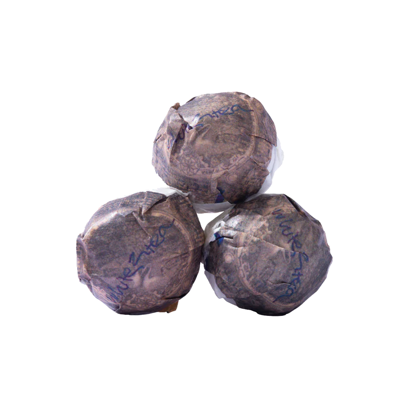

## 2024 Schedule White Mini -- 200 Euros ?!

A whole cake of this is worth around 200 Euros, which blows my mind, worse, it's a white tea ?! And a young one at that ?

I admit this picked my curiosity, perhaps too much for my wallet's good.

White2tea descibes this as:

"One of the most intense white teas we've ever had the pleasure of trying. Sweeping herbaceous bitterness and long lingering tacky mouthfeel that leaves sweetness in its wake. An intense feeling usually associated with raw Puer tea and a must try for any white tea lover who feels like they've experienced it all."

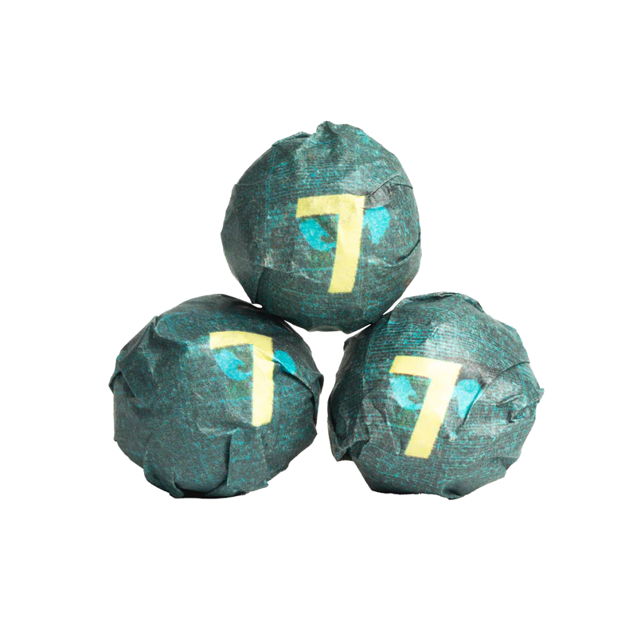

## 2024 Snitch Minis -- Cheaper, yet not Cheap.

This is definitely one of the cheapest offerings out there.

White2Tea descibes this tea as a "classic Menghai character, unbeatable value. Put this raw Puer blend up against any other vendor at the same price point and see what happens. If you don't like it, you're telling on yourself."

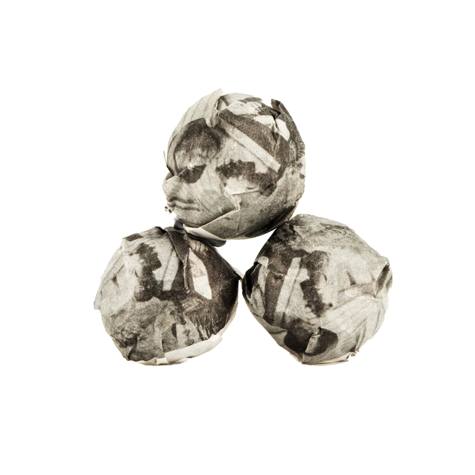

## 2024 Orientalism and the Generated Image Minis -- AI_Generated_This_Content;

Definitely the most w2t name you could ever give a tea, with an even more cryptic description that they changed today unfortunately since it was real funny !

Either way, white2tea now descibes this one as: "A testament to our Obsession with Puer tea. A blend with with plenty of aged material, unique character and complexity. Worth a thoughtful session."

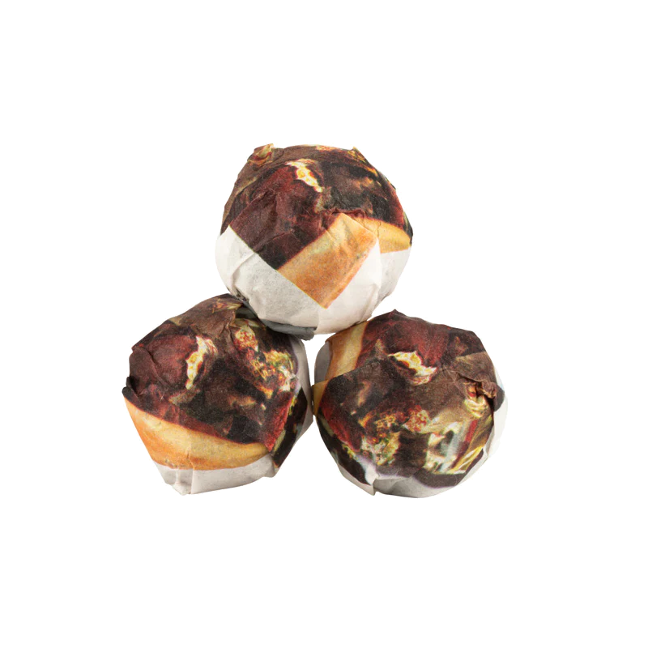

## 2024 Hypnotrain Minis -- Multilayered Goodness...

White2Tea descibes this tea as:

"Unfolding layered complexity of aroma and flavor. Slowly gains momentum before ramping up to a syrupy, entrancing sweetness that endures long after the tea is gone. Smoothed out with a multiple years of maocha from our storage, this tea is an experience straight out of the gate. Age further, it’ll just get sweeter."

Definitely one of the more unique propositions of this list.

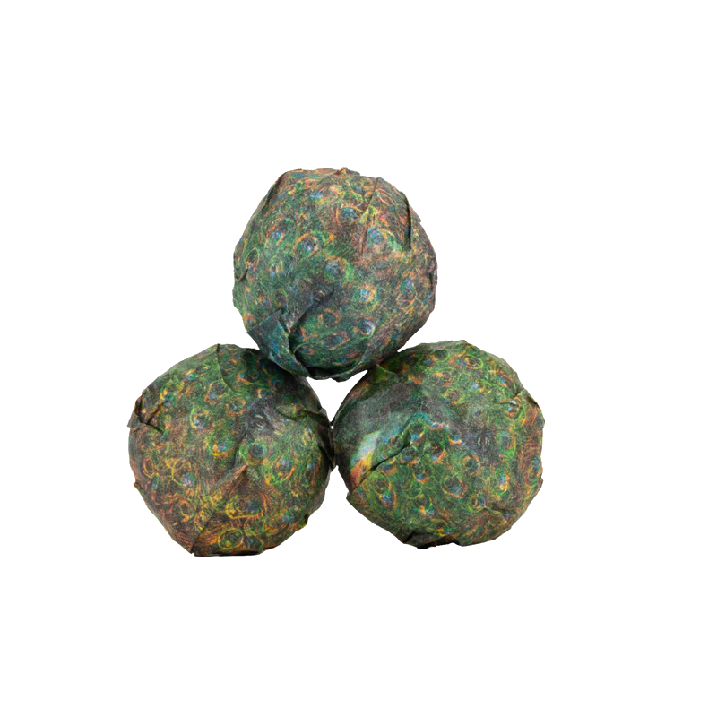

## 2024 Gas Minis -- Ark, Bitter bitter bitter !

White2Tea descibes this tea as:

"A raw Puer blend focused on mind bending bitterness. Fans of in your face bitter character will be happy to steep this tea in any style, though most people will not be able to handle anything but gongfu style flash steeps, especially while this tea retains its youthful vigor. You'll understand why it's named Gas around steep 5."

This is one of the teas I'm least excited to try, though I admit I've never challenged myself to purposfully torture my tongue like that.

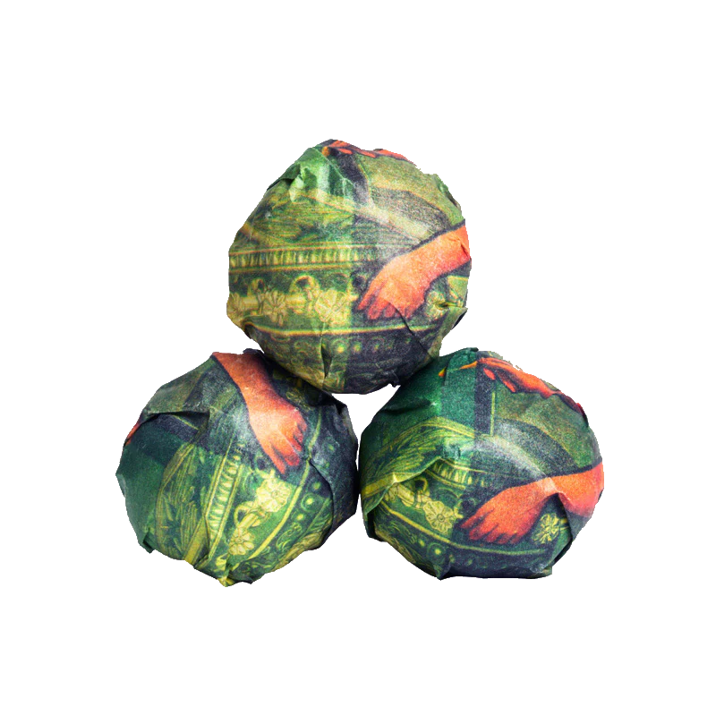

## 2024 Penetralia Minis -- Generic ?

White2Tea descibes this tea as:

"Sun dried assamica (large leaf varietal) from Yunnan that is usually destined for raw Puer production.

Our 2024 Penetralia is a thick bodied, rich and herbaceous black tea with depth and engaging layered flavors."

No further details are given, which given the price point is very suprising.

## 2024 Tihkal Minis -- The best blend of the year (supposedly).

White2Tea descibes this tea as:

"The best blend we made in 2024, after experimenting with and testing it during 2023 spring. It's an absolute bargain, which probably sounds contradictory because it's not cheap, but the blend is better than a lot of teas that cost twice as much. If you're a fan of our blends and it fits your budget, this is the one we wouldn't skip."

Cannot wait to try this blend out, I'm a big fan of Paul's tea experiments !

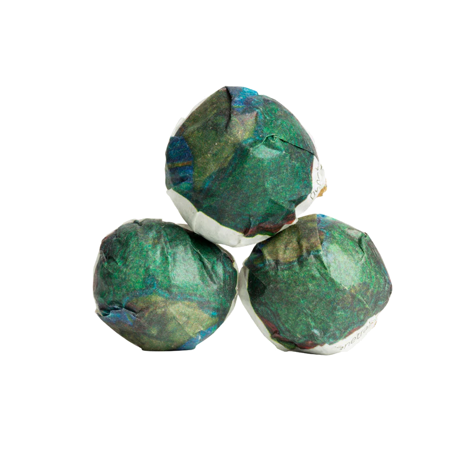

## 2024 Judy Minis -- Thicc and complex white tea ? Count me in 😈

White2Tea descibes this tea as:

"A sun dried Yunnan white tea made from camellia sinensis assamica (large leaf varietal) leaves from old trees, usually destined for raw Puer production.

A thick and complex white tea, with layered fragrances and sweetness throughout; poets grab your pens, there are more than a few outlandish descriptions lurking in the flavors of this tea. Engaging from start to finish during a gongfu session, with enough power to entice dedicated raw Puer lovers."

This definitely sounds like a unique white tea, I've been disappointed before by the lack of difference between some w2t white tea blends, I hope this will be a completely different experience.

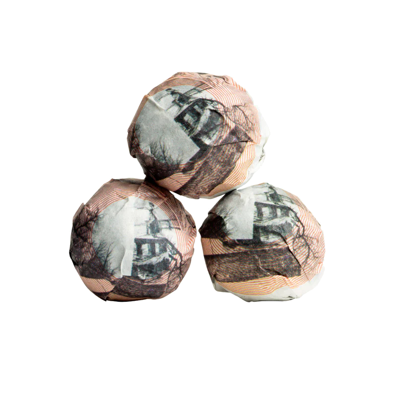

## 2024 Teadontlie Minis -- Guess who's back !

Okay, I heard a lot about the 2016 teadontlie, if this is as good we may be looking at the most impressive raw puer of the list for sure.

White2Tea writes:

"A return of our popular 2016 blend. A blend of raw Puer material that has a sweet, thick body. A heavy interior fruity floral fragrance and a bitey astringency that will calm down with age."

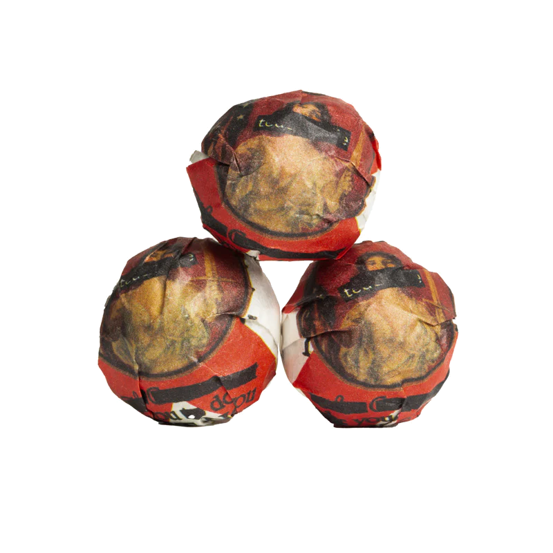

## 2024 Philtre Minis -- Maybe cheap...?

"Every spring we try to flex our blending skills by making at least one raw Puer tea blend that defies its price tag, spitting in the face of all of our expensive teas. This year that's the Philtre. Sticky long lasting huigan [returning sweetness] with bright aromas and powerful flavor, all with a price tag well worth buying a tong of. Drink now or age as you please."

Us tea people want the 0.10$/g teas with the characteristics of a 2$/g one, but I hope this can at least be the bridge between the two price points !

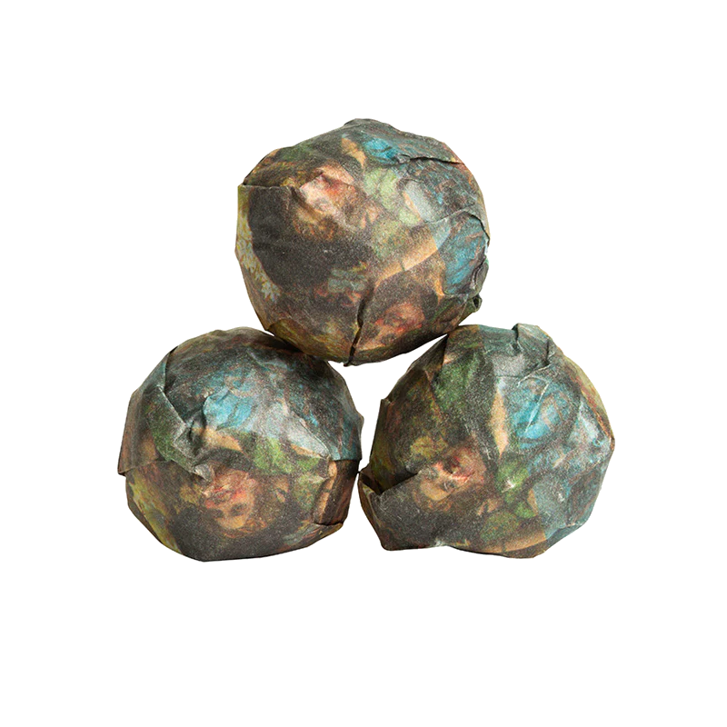

## Well well well, did you get lost little bear ?

The **2024 Moon Bear Mini** was a tea I wanted to try for a while, and although it wasn't on the list, I think this might be one of hardest teas to accurately place in a neat little category, can't wait to try it out.
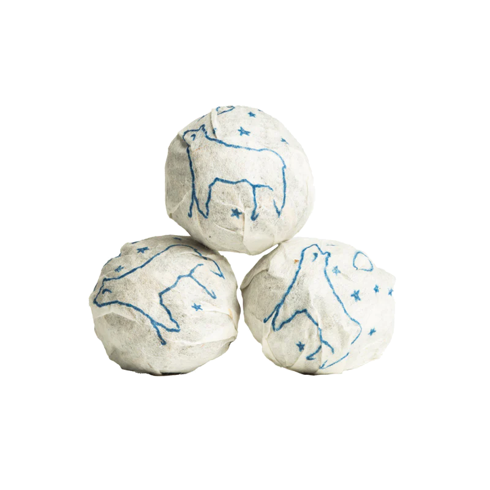

## Smokey, spicy, and everything in between.

I already reviewed the mini version of this Tea.
This is the [2024 Great Blue Heron Minis](https://skoomaden.me/posts/review-of-2024-great-blue-heron-by-white2tea/), I simply couldn't wait, this tea shocked me to my core, how can a tea be this good ? Probaby up there in my top 10, so I got myself a cake.

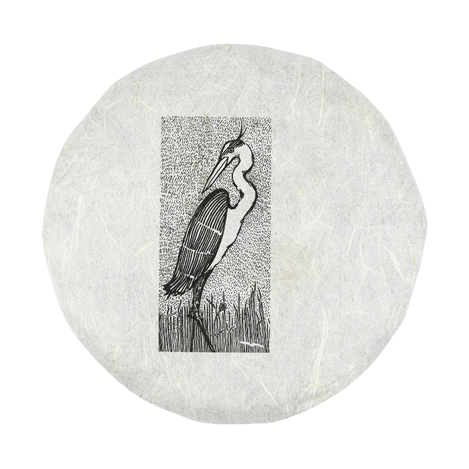

## So ? Do we keep breaking the bank ?

Probably not, this wasn't particularly cheap, but I often reward myself with teas when I think I do a good job in my IRL one. 

That being said, this is probably well worth it, prepare to be flodded with reviews my RSS-enabled folk, for the rest, don't forget to check out what I do from time to time, even a reaction down below is an extra smile in my sometimes all too rigid day.

As always, I thank you all for reading me,
Have an amazing time wherever you are.

  <mark>- yaro</mark>