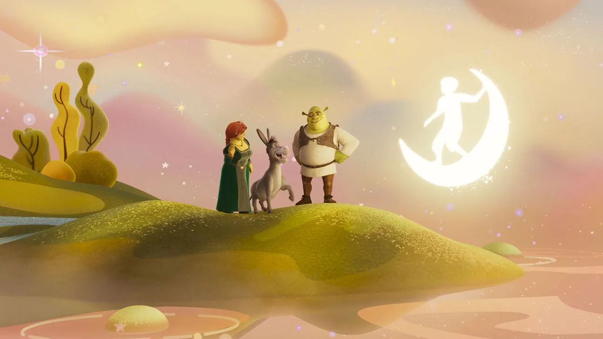

L'industrie de l'animation, autrefois dominée par Disney et Pixar, traverse aujourd’hui une phase de stagnation. Disney, en particulier, semble s'être enfermé dans un cycle de remakes nostalgiques, transformant ses succès passés en copies aseptisées et dénuées d'innovation. Le public se retrouve face à un vide créatif, un manque palpable de propositions nouvelles. C’est ici que DreamWorks se distingue. Depuis sa fondation, le studio a fait le pari de l'audace, se positionnant comme l'antithèse du modèle Disney. DreamWorks a pris des risques tant artistiquement que narrativement, une stratégie qui rappelle Pixar à son apogée, lorsque chaque production bousculait les attentes.

Mais la question est cruciale : DreamWorks peut-il continuer à rester ce leader créatif, ou finira-t-il par céder aux sirènes de la répétition et de l'exploitation mercantile ?

## Critique et Parodie

En 2001, Shrek a marqué un tournant décisif dans l'histoire de l'animation. Non seulement il a révolutionné la forme en proposant un anti-héros aussi brut qu'attachant, mais il a surtout utilisé la parodie pour déconstruire les contes de fées traditionnels que Disney chérissait tant. L'humour corrosif et les références à la culture populaire ont permis à Shrek de se moquer des archétypes classiques, à commencer par Lord Farquaad et son royaume de Duloc, une satire évidente des parcs à thème trop lisses.

> <mark>"Shrek est une critique acerbe des idéaux de beauté et des récits héroïques que Disney avait érigés en norme."</mark>

L'Originalité de l'œuvre n'est pas la seule chose que la différencie, mais aussi sur l’ampleur de son impact culturel. Il a ouvert la porte à une nouvelle forme de narration en animation, alliant satire et humour accessible, aussi bien aux enfants qu’aux adultes. En subvertissant les attentes classiques, Shrek a non seulement défié Disney sur son propre terrain, mais a également démontré qu’un autre modèle d’animation pouvait prospérer.

Cependant, cette révolution a été de courte durée. À partir de *Shrek the Third*, la franchise a progressivement perdu de sa mordante subversion pour devenir une exploitation commerciale. Les suites ont échoué à maintenir l'élan créatif du premier film, se contentant de recycler les blagues et les tropes sans chercher à innover. Ce qui avait commencé comme une rébellion contre Disney s'est transformé en un modèle répétitif, symptomatique de la difficulté pour un studio à concilier créativité et succès financier.

## Maîtrise Technique

En matière de technique pure, peu de films peuvent rivaliser avec *How to Train Your Dragon*. Le film est un véritable tour de force visuel, exploitant pleinement la profondeur de champ, la HDR et les visuels en 4K pour créer des scènes à couper le souffle. Les séquences de vol, en particulier, sont des moments de virtuosité technique où chaque détail, chaque nuance de couleur est optimisé pour une immersion totale. Dragons ne se contente pas de raconter une histoire ; il l’incarne visuellement.

> <mark>"Dragons prouve que DreamWorks a su se hisser au niveau de Pixar en termes de prouesse visuelle, mais avec une identité propre."</mark>

Il s'agit aussi d'une œuvre profondément émotive, notamment à travers le parcours du personnage de Hiccup. La perte de son membre en fait un héros vulnérable, un détail rare dans les récits d'animation, et cette vulnérabilité ajoute une profondeur émotionnelle au film. Dragons fusionne ainsi l’excellence visuelle avec une narration émotionnelle puissante, offrant un exemple de ce que l’animation peut accomplir lorsque la technique sert véritablement le récit.

## Réinvention Visuelle et Thématique

Avec *Puss in Boots: The Last Wish*, DreamWorks montre qu'il n’a pas peur de repousser les limites esthétiques. Inspiré par *Into the Spider-Verse*, le film ose un style visuel qui s’éloigne du CGI traditionnel pour explorer des techniques plus proches de l’animation dessinée à la main. Ce choix stylistique ne se contente pas d’imiter ; il crée une esthétique unique qui marque un véritable renouveau pour la franchise. DreamWorks montre ici une prise de risque que peu de studios osent prendre.

> <mark>"DreamWorks a su capturer l’essence du conte tout en réinventant ses codes visuels, créant une œuvre aussi audacieuse que captivante."</mark>

Là où The Last Wish va encore plus loin, c’est dans ses thèmes. Le film aborde la mortalité et la vulnérabilité d’une manière rarement vue dans les films d’animation. En explorant ces sujets tout en conservant un humour accessible, The Last Wish touche plusieurs générations. Ce mélange subtil de thématiques sérieuses et de légèreté démontre la capacité de DreamWorks à élever la barre de la narration en animation.

## Ambition Introspective

The Wild Robot était censé être une œuvre radicale pour DreamWorks, rappelant des films comme WALL-E avec une narration visuelle pure. L’idée d’un film sans dialogue représentait un défi ambitieux, un retour à une forme de communication plus subtile. Mais les projections test ont révélé que le public moderne, et surtout les jeunes, n’était plus capable de maintenir leur attention sans dialogue, forçant DreamWorks à abandonner cette idée.

> <mark>"The Wild Robot aurait pu redéfinir l'animation moderne, mais a été compromis par une audience en quête de narrations plus simples."</mark>

Finalement, The Wild Robot reflète le dilemme permanent auquel DreamWorks fait face : comment innover artistiquement tout en satisfaisant les attentes commerciales ? Même si le film reste une réussite visuelle et thématique, il est aussi symptomatique des tensions entre l’audace artistique et les impératifs du box-office.

## Conclusion : DreamWorks face à son Avenir

DreamWorks se trouve à une croisée des chemins. Après avoir prouvé à plusieurs reprises qu’il était capable d’innover et de prendre des risques créatifs, la tentation de céder à la facilité de l’exploitation commerciale est forte. La question est donc simple : le studio continuera-t-il à repousser les limites, ou succombera-t-il à la répétition, comme Pixar avant lui ?

> <mark>"DreamWorks doit choisir entre innovation et stagnation, car c'est en refusant la facilité qu'il pourra rester un leader créatif."</mark>

Pour garantir son avenir, DreamWorks devra encourager la créativité interne, continuer à prendre des risques audacieux, et surtout, rester fidèle à sa vision initiale : celle d'un studio qui ose bousculer les normes.
