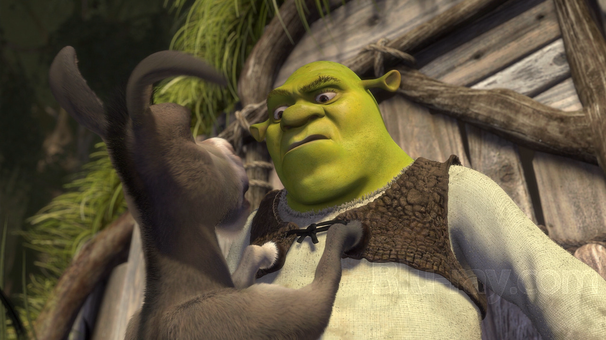

The animation industry, once dominated by Disney and Pixar, is now in a phase of stagnation. Disney, in particular, seems to have trapped itself in a cycle of nostalgic remakes, turning its past successes into sanitized, innovation-free copies. The audience is left facing a creative void, with a noticeable lack of fresh ideas. This is where DreamWorks stands out. Since its founding, the studio has embraced boldness, positioning itself as the antithesis of the Disney model. DreamWorks has taken risks both artistically and narratively, a strategy reminiscent of Pixar at its peak, when every production defied expectations.

But the question remains crucial: Can DreamWorks continue to be this creative leader, or will it eventually succumb to the lure of repetition and commercial exploitation?

## Critique and Parody

In 2001, *Shrek* marked a decisive turning point in animation history. Not only did it revolutionize the genre by offering a raw, yet endearing, anti-hero, but it also used parody to deconstruct the traditional fairy tales Disney held so dear. The biting humor and references to pop culture allowed *Shrek* to mock classic archetypes, starting with Lord Farquaad and his kingdom of Duloc, an obvious satire of overly polished theme parks.

> <mark>"Shrek is a sharp critique of the ideals of beauty and heroic narratives that Disney had elevated to the standard."</mark>

The originality of the work is not only what sets it apart but also the scale of its cultural impact. It opened the door to a new form of animated storytelling, blending satire with humor accessible to both children and adults. By subverting classic expectations, *Shrek* not only challenged Disney on its own turf but also demonstrated that an alternative animation model could thrive.

However, this revolution was short-lived. Starting with *Shrek the Third*, the franchise gradually lost its biting subversion and became a commercial exploitation. The sequels failed to maintain the creative momentum of the first film, settling for recycled jokes and tropes without seeking innovation. What began as a rebellion against Disney turned into a repetitive model, symptomatic of the difficulty for a studio to reconcile creativity with financial success.

## Technical Mastery

In terms of pure technique, few films can rival *How to Train Your Dragon*. The film is a true visual tour de force, fully exploiting depth of field, HDR, and 4K visuals to create breathtaking scenes. The flight sequences, in particular, are moments of technical virtuosity where every detail, every nuance of color is optimized for total immersion. *Dragons* doesn’t just tell a story; it visually embodies it.

> <mark>"Dragons proves that DreamWorks has risen to Pixar's level in terms of visual prowess, but with its own unique identity."</mark>

It is also a deeply emotional work, especially through the character arc of Hiccup. The loss of his limb makes him a vulnerable hero, a rare detail in animated narratives, and this vulnerability adds emotional depth to the film. *Dragons* thus fuses visual excellence with powerful emotional storytelling, offering an example of what animation can achieve when technique truly serves the narrative.

## Visual and Thematic Reinvention

With *Puss in Boots: The Last Wish*, DreamWorks shows it is unafraid to push aesthetic boundaries. Inspired by *Into the Spider-Verse*, the film dares to break away from traditional CGI to explore techniques closer to hand-drawn animation. This stylistic choice doesn't just imitate; it creates a unique aesthetic that marks a genuine revival for the franchise. DreamWorks shows here a willingness to take risks that few studios dare to take.

> <mark>"DreamWorks has captured the essence of the fairy tale while reinventing its visual codes, creating a work as bold as it is captivating."</mark>

Where *The Last Wish* goes even further is in its themes. The film addresses mortality and vulnerability in a way rarely seen in animated films. By exploring these subjects while maintaining accessible humor, *The Last Wish* resonates with multiple generations. This subtle blend of serious themes and lightness demonstrates DreamWorks’ ability to raise the bar for storytelling in animation.

## Introspective Ambition

*The Wild Robot* was meant to be a radical work for DreamWorks, reminiscent of films like *WALL-E* with its pure visual storytelling. The idea of a film without dialogue represented an ambitious challenge, a return to a more subtle form of communication. But test screenings revealed that modern audiences, especially young ones, were no longer capable of maintaining their attention without dialogue, forcing DreamWorks to abandon the idea.

> <mark>"The Wild Robot could have redefined modern animation, but was compromised by an audience seeking simpler narratives."</mark>

Ultimately, *The Wild Robot* reflects the ongoing dilemma DreamWorks faces: how to innovate artistically while meeting commercial expectations? Even though the film remains a visual and thematic success, it is also symptomatic of the tension between artistic boldness and box-office demands.

## Conclusion: DreamWorks at a Crossroads

DreamWorks finds itself at a crossroads. Having repeatedly proven that it can innovate and take creative risks, the temptation to succumb to the ease of commercial exploitation is strong. The question is simple: will the studio continue to push boundaries, or will it fall into repetition, like Pixar before it?

> <mark>"DreamWorks must choose between innovation and stagnation, as it is only by refusing the easy path that it can remain a creative leader."</mark>

To secure its future, DreamWorks will need to foster internal creativity, continue taking bold risks, and most importantly, stay true to its original vision: that of a studio unafraid to challenge norms.
