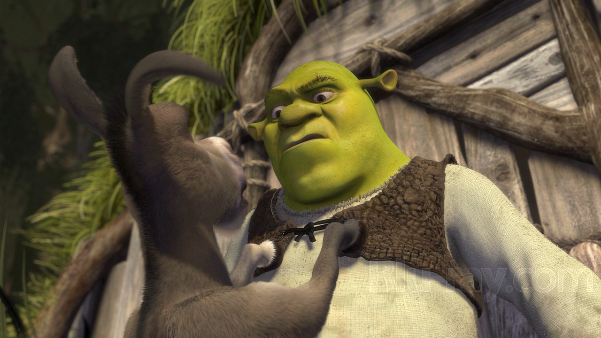
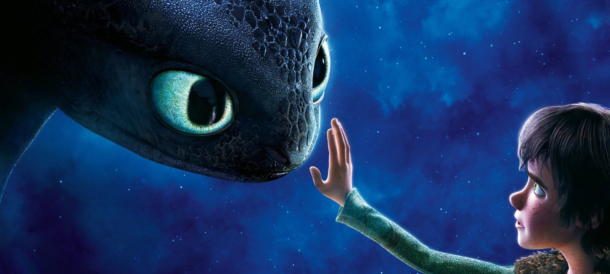
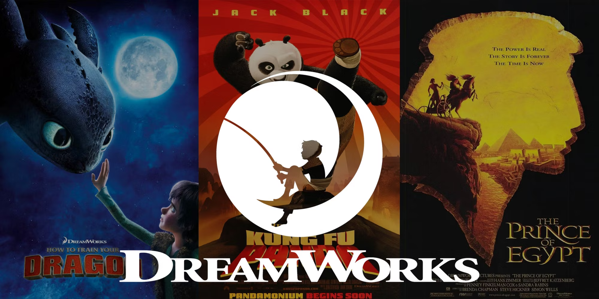
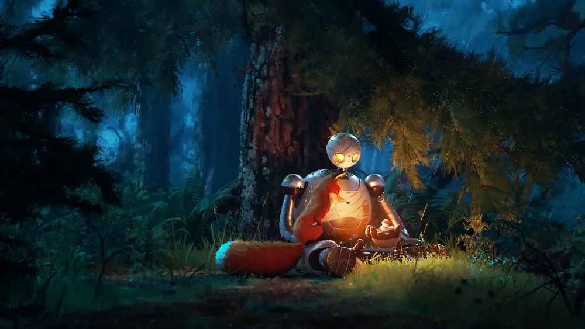
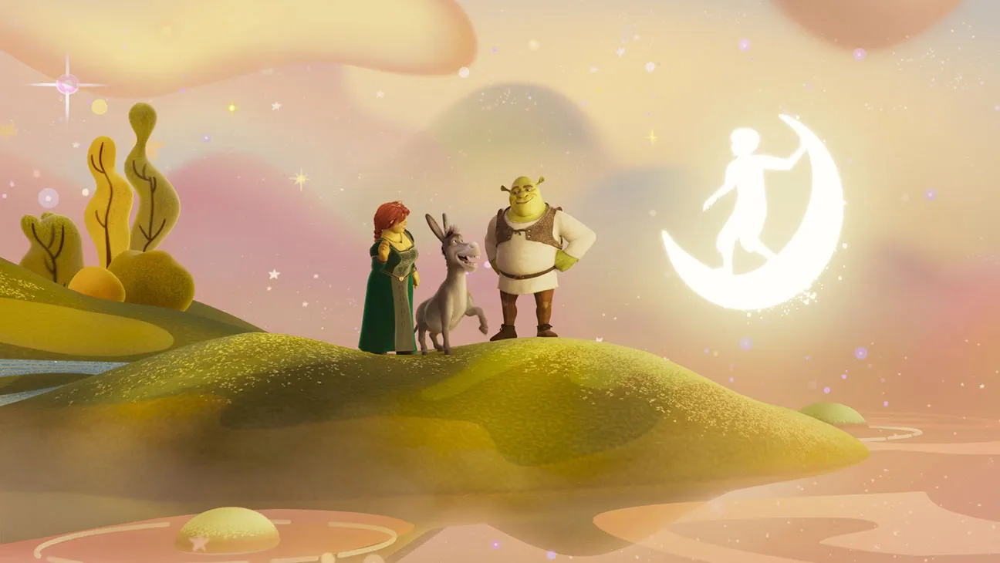
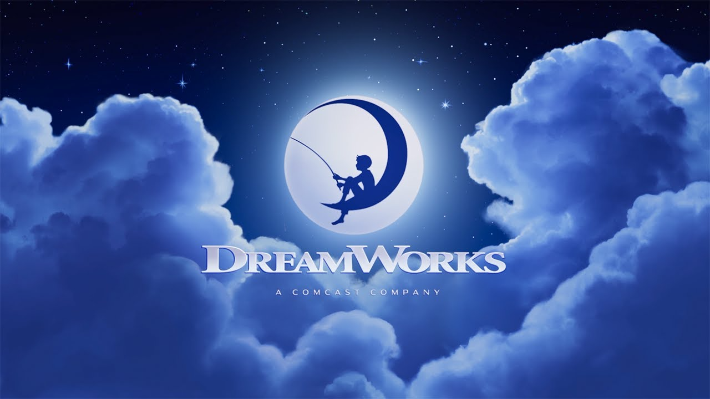

---
title: "Le Robot Sauvage, Le Chat Potté & L'Âge d'Or de DreamWorks"  
date: 2024-10-08  
tags: ['Multimédia', 'Français']  
description: "Une analyse en profondeur de DreamWorks à travers ses œuvres phares."  
cover: "/covers/cover-dreamworks.jpg"  
---  

## The Wild Robot, Puss in Boots & DreamWorks’ Golden Age

Certains studios d'animation reposent sur un modèle qui, bien qu'efficace, laisse peu de place à l'innovation. [Disney](https://www.vulture.com/2019/07/disney-remakes-box-office-nostalgia.html), par exemple, a construit une machine à nostalgie, capitalisant sur ses franchises classiques en les remettant inlassablement au goût du jour, comme un disque que l'on repasse en boucle. La formule fonctionne – il serait difficile de le nier – mais elle montre aussi une certaine frilosité créative, un refus de sortir de la zone de confort. Le royaume enchanté de Disney s’apparente souvent à une forteresse imprenable, gardée par des remakes et des [Adultes Disney](https://www.rollingstone.com/culture/culture-features/disney-adults-tiktok-hated-internet-1370226/).    
Mais si Disney est le roi incontesté de la nostalgie, [DreamWorks](https://fr.wikipedia.org/wiki/DreamWorks_Animation) a choisi une approche radicalement différente, refusant de se laisser enfermer dans les archétypes classiques de l'animation occidentale. Dès ses débuts, [DreamWorks](https://fr.wikipedia.org/wiki/DreamWorks_Animation) s’est positionné comme l'antithèse des grands studios traditionnels, défiant les conventions avec audace. Loin de se contenter d'une formule unique, le studio a constamment repoussé les frontières de ce qu’un film d’animation peut raconter, touchant des thèmes et des univers aussi variés que la Chine ancienne, la mythologie viking, ou encore les bas-fonds des contes de fées. C’est ici que [DreamWorks](https://fr.wikipedia.org/wiki/DreamWorks_Animation) s’est forgé une identité propre, en tant que studio capable de surprendre et de se réinventer, à une époque où ses concurrents semblaient davantage intéressés par le passé que par l'avenir.  

## L'Antihéros : Shrek  

Shrek n’est pas seulement un film, c’est un phénomène culturel. En 2001, alors que Disney continue de s'appuyer sur ses récits enchanteurs et ses princesses immaculées, Shrek débarque en [dynamitant joyeusement les codes du genre](https://www.indiewire.com/2021/05/shrek-20th-anniversary-legacy-disney-1234636419/). Avec son anti-héros ogre, grossier mais attachant, et ses décors où règnent la dérision et le sarcasme, [DreamWorks](https://fr.wikipedia.org/wiki/DreamWorks_Animation) prend une position frontale contre Disney. Shrek, c’est l'opposition par la structure du conte de fées traditionnel.   
C’est ici que l’on voit la subtilité de [DreamWorks](https://fr.wikipedia.org/wiki/DreamWorks_Animation). Derrière cette surface irrévérencieuse se cache un cœur battant d’émotion et de vulnérabilité. La 3D, à l’époque encore en pleine explosion, est ici utilisée pour sublimer les imperfections des personnages, et non pour lisser la réalité. Tout dans Shrek crie la rupture avec les standards de l’animation : des personnages imparfaits, des décors qui tournent en dérision les châteaux de conte de fées, jusqu’à l’humour, bien plus adulte que ce que l'on osait imaginer à l’époque. Ce premier succès massif cimente [DreamWorks](https://fr.wikipedia.org/wiki/DreamWorks_Animation) comme le studio qui ne joue pas selon les règles établies, mais qui les réécrit.    

## Savoir s'exporter : Kung Fu Panda  

En 2008, [DreamWorks](https://fr.wikipedia.org/wiki/DreamWorks_Animation) fait un pari ambitieux avec [Kung Fu Panda](https://en.wikipedia.org/wiki/Kung_Fu_Panda). Là où la plupart des studios d'animation occidentaux puisent dans des récits universels ou des contes de fées européens, [DreamWorks](https://fr.wikipedia.org/wiki/DreamWorks_Animation) fait un saut dans l'inconnu en choisissant de situer son film en Chine, avec un respect profond pour sa culture et ses traditions. Ce n'est pas un simple décor exotique ; c’est un hommage à la richesse culturelle et spirituelle chinoise. Le film s'inspire des philosophies taoïstes et bouddhistes, explorant des thèmes comme l'équilibre entre le corps et l'esprit, et le cheminement personnel.    
Po, le héros maladroit mais attachant, incarne cette quête taoïste du Wu wei, l'action sans effort, où l'acceptation de soi est la clé du succès. [Kung Fu Panda](https://time.com/5009271/kung-fu-panda-chinese-culture/) ne se contente pas d'emprunter des éléments de la culture chinoise ; il les intègre pleinement, tant sur le plan visuel que philosophique. Les scènes d’action sont chorégraphiées avec une précision digne des grands films d’arts martiaux, et tout les grands paysages sont inspirés de peintures traditionnelles chinoises.    
Le film est un succès retentissant, non seulement aux États-Unis, mais aussi en Chine, où il est accueilli comme un hommage respectueux à leur culture. [DreamWorks](https://fr.wikipedia.org/wiki/DreamWorks_Animation), à travers ce film, prouve qu’il est possible de créer une œuvre ancrée dans des valeurs locales tout en étant universelle, une approche qui a clairement distingué le studio de ses concurrents. Ce n'était pas qu'un simple succès commercial ; c’était un pont culturel, une démonstration de la capacité de l'animation à transcender les frontières.    

## Technique : Dragons 

Deux ans après Kung Fu Panda, [DreamWorks](https://fr.wikipedia.org/wiki/DreamWorks_Animation) frappe à nouveau avec [Dragons (How to Train Your Dragon)](https://www.npr.org/2014/06/13/321281040/review-how-to-train-your-dragon-2). Ici, le studio s'éloigne des clichés de la mythologie nordique pour offrir une vision nouvelle et rafraîchissante de l'univers viking. Là où l'on aurait pu s'attendre à des batailles épiques contre des dragons sanguinaires, le film choisit de présenter ces créatures sous un jour différent : puissants, majestueux, mais incompris. [Dragons](https://www.slashfilm.com/527604/how-to-train-your-dragon-a-perfect-piece-of-animation/) réinvente le mythe du monstre, le transformant en une métaphore de l'acceptation de l'autre et de la quête d'identité.    
Ce qui rend [Dragons](https://fr.wikipedia.org/wiki/How_to_Train_Your_Dragon_(film)) si mémorable, ce ne sont pas seulement ses visuels ou ses scènes de vol spectaculaires — bien que celles-ci aient repoussé les limites de ce que l’animation 3D pouvait accomplir à l’époque. Non, ce qui frappe avant tout, c’est la profondeur émotionnelle du film. Harold, le jeune héros, ne suit pas le chemin traditionnel du héros viking ; il défie les attentes, celles de son père, de sa communauté, et même du spectateur. Le film aborde des thèmes universels : la rébellion, la compréhension intergénérationnelle, et surtout, la capacité à changer de perspective face à l’inconnu.    

## L'Âge d'Or de DreamWorks 
 
Le trou laissé par [Pixar](https://fr.wikipedia.org/wiki/Pixar_Animation_Studios) après le début des années 2010 n’a pas seulement été un choc pour l’industrie de l’animation, c’était une opportunité. Une opportunité que [DreamWorks](https://fr.wikipedia.org/wiki/DreamWorks_Animation) a su saisir avec une ambition à la fois audacieuse et calculée. Alors que [Pixar](https://www.cnet.com/culture/entertainment/the-rise-fall-and-return-of-pixar-animation/) a vu ses récits sombrer dans une répétition confortable — Cars 2, Monstres Academy, et Finding Dory en étant les exemples les plus symptomatiques — [DreamWorks](https://fr.wikipedia.org/wiki/DreamWorks_Animation) a pris la décision de faire ce que Pixar ne faisait plus : innover.    

## Réinvention Stylistique: The Last Wish

En 2022, [Puss in Boots: The Last Wish](https://en.wikipedia.org/wiki/Puss_in_Boots:_The_Last_Wish) incarne cette capacité de [DreamWorks](https://fr.wikipedia.org/wiki/DreamWorks_Animation) à réinventer non seulement ses personnages, mais aussi sa direction artistique. Ce film n’est pas une simple suite à un spin-off. C’est un film qui s’affranchit des attentes. Là où la première incursion de Puss était encore ancrée dans le ton irrévérencieux de Shrek, [The Last Wish](https://en.wikipedia.org/wiki/Puss_in_Boots:_The_Last_Wish) s'aventure dans des territoires visuels et thématiques plus profonds. Inspiré par des œuvres comme Spider-Man: Into the Spider-Verse, le film adopte une esthétique proche du conte de fées illustré, tout en restant un produit de haute technologie. Chaque scène est un tableau, avec une texture visuelle qui donne un relief inégalé à l’animation. Et ce choix visuel n'est pas anodin. Il sert un récit qui explore la mortalité d’un héros qui a épuisé huit de ses neuf vies. Un sujet audacieux pour un film destiné à un public familial, mais qui s’inscrit parfaitement dans cette volonté de [DreamWorks](https://fr.wikipedia.org/wiki/DreamWorks_Animation) d’élever son discours tout en s’adressant à plusieurs générations.    
Ce que [Puss in Boots: The Last Wish](https://en.wikipedia.org/wiki/Puss_in_Boots:_The_Last_Wish) fait de manière si remarquable, c’est de fusionner ces nouvelles ambitions visuelles avec une profondeur émotionnelle. C’est un film qui ne se contente pas d’éblouir par son style — il parvient à transmettre des idées sur la peur de la mort, l’amour et l’amitié. En cela, il dépasse ce que Pixar tentait encore de faire dans ses films récents, en apportant une émotion authentique sans se reposer sur des concepts déjà éprouvés.    

## Introspection : The Wild Robot 

Et puis il y a [The Wild Robot](https://en.wikipedia.org/wiki/The_Wild_Robot), l’un des projets les plus audacieux de [DreamWorks](https://fr.wikipedia.org/wiki/DreamWorks_Animation) depuis des années. Adapté du roman de Peter Brown, ce film se veut un antidote à l’animation bruyante et saturée qui domine souvent les écrans. Initialement imaginé comme un film silencieux – chose qui n’a malheureusement pas été retenu dû au retour des enfants durant les projections tests, [The Wild Robot](https://www.penguinrandomhouse.com/books/317222/the-wild-robot-by-peter-brown/) est une expérience épurée, introspective, qui s’appuie sur la puissance de ses visuels pour transmettre ses thèmes : l’adaptation, la survie et, surtout, la découverte de soi.   
Loin des scènes d’action effrénées de Puss in Boots, [The Wild Robot](https://en.wikipedia.org/wiki/The_Wild_Robot) propose une immersion dans un monde presque méditatif, où chaque interaction entre Roz, le robot égaré, et la faune locale est une leçon sur la communication, l’acceptation et la différence. Ce choix de mise en scène, loin des dialogues omniprésents et des explosions d’effets spéciaux, montre que [DreamWorks](https://fr.wikipedia.org/wiki/DreamWorks_Animation) sait aussi manier le silence pour créer de l’émotion. C’est là que le studio fait une réelle différence dans un paysage où les films d’animation tendent à privilégier le rythme au détriment de la réflexion.    

## Une Nouvelle Direction pour DreamWorks  

[Puss in Boots: The Last Wish](https://en.wikipedia.org/wiki/Puss_in_Boots:_The_Last_Wish) et [The Wild Robot](https://en.wikipedia.org/wiki/The_Wild_Robot) partagent plus qu’un simple ADN [DreamWorks](https://fr.wikipedia.org/wiki/DreamWorks_Animation). Ces deux films incarnent une stratégie de rebranding plus large du studio, qui a compris que pour survivre face aux mastodontes que sont [Disney](https://www.vulture.com/2019/07/disney-remakes-box-office-nostalgia.html) et [Pixar](https://fr.wikipedia.org/wiki/Pixar_Animation_Studios), il fallait non seulement proposer quelque chose de différent, mais aussi de significatif. Là où [Pixar](https://www.cnet.com/culture/entertainment/the-rise-fall-and-return-of-pixar-animation/) semble s’être enfermé dans une dynamique de suites et de reboots, [DreamWorks](https://fr.wikipedia.org/wiki/DreamWorks_Animation), avec ces deux œuvres, prouve qu’il est encore capable de surprendre.    
Ce rebranding, qui joue à la fois sur la nostalgie visuelle — avec des références aux contes de fées dans [Puss in Boots](https://en.wikipedia.org/wiki/Puss_in_Boots:_The_Last_Wish) — et sur une épure narrative — avec [The Wild Robot](https://en.wikipedia.org/wiki/The_Wild_Robot) —, marque un tournant. [DreamWorks](https://fr.wikipedia.org/wiki/DreamWorks_Animation) ne se repose plus sur ses lauriers, mais redéfinit les attentes du public vis-à-vis de l’animation. Il y a ici une volonté de reconnecter avec l’essence même du cinéma d’animation : raconter des histoires avec émotion, inventivité et pertinence visuelle.  
Alors que [Pixar](https://fr.wikipedia.org/wiki/Pixar_Animation_Studios) continue de livrer des productions souvent prévisibles, [DreamWorks](https://fr.wikipedia.org/wiki/DreamWorks_Animation), lui, ose prendre des risques. Et ces risques payent. En explorant des styles visuels et narratifs aussi différents mais complémentaires, [Puss in Boots](https://en.wikipedia.org/wiki/Puss_in_Boots:_The_Last_Wish) et [The Wild Robot](https://en.wikipedia.org/wiki/The_Wild_Robot) ne sont pas seulement des films d’animation, ils sont une déclaration : [DreamWorks](https://fr.wikipedia.org/wiki/DreamWorks_Animation) est là pour innover, pour surprendre, et pour marquer durablement le paysage cinématographique.    

## Conclusion

[DreamWorks](https://fr.wikipedia.org/wiki/DreamWorks_Animation) s’est frayé une place, tout d’abord en choquant et puis en affinant son pari sur l'innovation. La question est maintenant de savoir jusqu'où cette approche peut les mener. Car si [DreamWorks](https://fr.wikipedia.org/wiki/DreamWorks_Animation) brille aujourd'hui par ses choix visuels audacieux et ses récits profonds, la répétition des risques peut aussi entraîner une saturation.    
Le cinéma d’animation est en perpétuelle évolution, mais [DreamWorks](https://fr.wikipedia.org/wiki/DreamWorks_Animation) doit rester vigilant. Comme l’a montré [Pixar](https://fr.wikipedia.org/wiki/Pixar_Animation_Studios) avant eux, l'innovation constante est difficile à maintenir. Chaque film qui repousse les frontières laisse planer la menace de la stagnation si cette exploration devient elle-même une formule. [DreamWorks](https://fr.wikipedia.org/wiki/DreamWorks_Animation) doit donc continuer à réinventer l’animation, mais sans céder à l'excès.    
Le paradoxe auquel [DreamWorks](https://fr.wikipedia.org/wiki/DreamWorks_Animation) fait face est simple : innover tout en maintenant une cohérence narrative forte. Un équilibre fragile entre maîtrise technique et profondeur narrative. Si [DreamWorks](https://fr.wikipedia.org/wiki/DreamWorks_Animation) veut véritablement écrire une nouvelle page de l’animation, il lui faudra éviter les pièges dans lesquels ses prédécesseurs sont tombés, et trouver le juste milieu entre la nouveauté et l’intégrité de son identité.  
