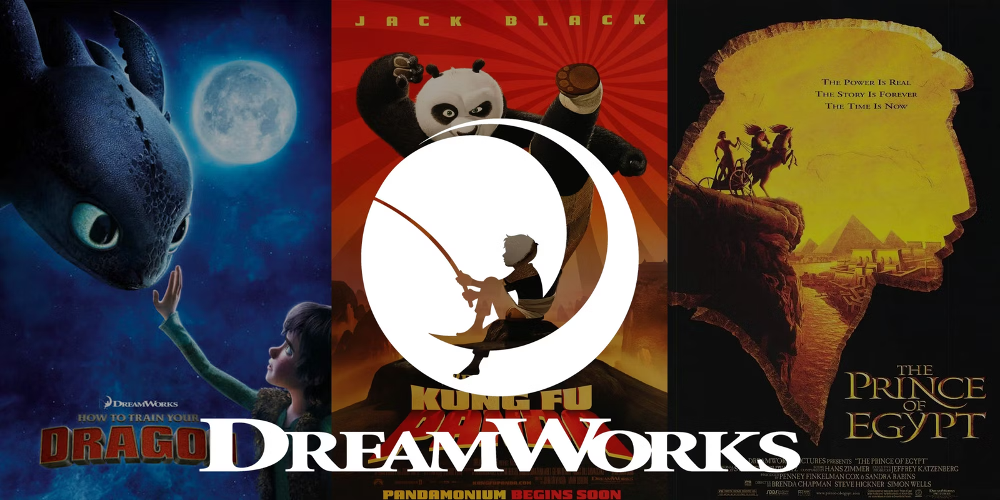
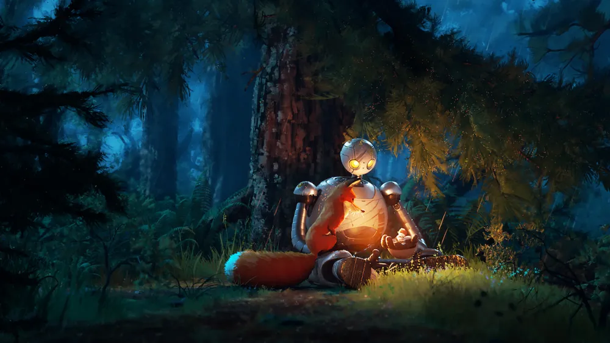

Some animation studios have fallen into a routine, endlessly repeating the same recipes until the flavor becomes as bland as a rerun. [Disney](https://www.vulture.com/2019/07/disney-remakes-box-office-nostalgia.html), of course, is the first to fall under this critique. Whether they ride the nostalgia wave with uninspired remakes or exhaust aging franchises, everything they do seems crafted to please a captive audience, rather than innovate. Meanwhile, [DreamWorks](https://en.wikipedia.org/wiki/DreamWorks_Animation) long positioned itself as the antidote to this monotony: the provocateur, the insolent, the studio that shook the gilded walls of the industry in a stagnant market.

But the increasingly pressing question is: Is DreamWorks still that troublemaker, or has it too become a factory of worn-out concepts, concealed under a shiny layer of style and technique? Because while, on the surface, DreamWorks takes risks with varied narratives and bold stylistic choices, we must not be blind to what lies beneath this veneer: opportunism, perhaps more subtle than Disney's, but opportunism nonetheless.

## The Antihero: Shrek  

In 2001, Shrek was a masterstroke for [DreamWorks](https://en.wikipedia.org/wiki/DreamWorks_Animation), but mostly a strike against Disney. The filthy ogre dynamited mainstream animation of the time, mocking perfect princesses and sugar-coated stories. Everything was there to appeal to an audience that was growing tired of infantilizing narratives. But looking closer, DreamWorks' "rebellion" wasn't all that disinterested. The studio knew exactly what it was doing: taking over the space left vacant by a lack of innovation elsewhere, giving the audience exactly what they wanted — a critique of fairy tales, while exploiting the same tropes to seduce.

And that's where the issue lies. Shrek, although brilliant in its apparent subversion, was also the starting point for an easy formula. Yes, the rules were broken, but only to build new ones just as exploitable. After Shrek, [DreamWorks](https://en.wikipedia.org/wiki/DreamWorks_Animation) didn't hesitate to ride the same wave of sarcasm, second-degree humor, and clumsy antiheroes to launch a series of films that, through repetition, lost the initial bite.

## Exporting Well: Kung Fu Panda  

In 2008, [DreamWorks](https://en.wikipedia.org/wiki/DreamWorks_Animation) didn’t just attempt to prove it could be more than a subversive studio with [*Kung Fu Panda*](https://en.wikipedia.org/wiki/Kung_Fu_Panda); it demonstrated the studio’s sharp understanding of not just commercial expansion, but cultural influence. As the Western world looked toward China, particularly in a pivotal year that saw the Beijing Olympics and Hu Jintao’s policies pushing China into the global spotlight, DreamWorks was ready with a film that did more than sell tickets — it sold cultural capital.

While some might dismiss *Kung Fu Panda* as a calculated move to crack open the Asian market, there’s more at play. DreamWorks didn’t just slap a Chinese aesthetic onto a generic storyline; they made a film that, intentionally or not, became part of a broader conversation about the accessibility of Chinese culture in the West. 2008 wasn’t just any year — it marked a key moment in China’s opening to the world, and DreamWorks smartly positioned itself as the studio ready to ride that wave.

Yes, the film’s success in China was strategic, but to reduce *Kung Fu Panda* to pure opportunism would be missing the point. This was DreamWorks proving that animation could bridge cultural divides in a way that wasn’t just about pandering to a new market, but about engaging with it meaningfully. By deeply integrating Chinese philosophy, traditions, and visuals, the film wasn’t just a commercial success; it was a cultural statement, even if DreamWorks had one eye on the box office the whole time.

But let’s not be naive. DreamWorks, with all its talk of cultural exchange, still had plenty of motivation rooted in profit. The film’s reverence for its source material may be genuine, but don’t think for a second that it wasn’t also meticulously crafted to appeal to the wallets of both Western and Eastern audiences. *Kung Fu Panda* is a rare example of cultural export done right, but it's also a reminder that even when a studio gets it right, the bottom line is always part of the equation.

## Technique: Dragons  

With [*Dragons*](https://www.npr.org/2014/06/13/321281040/review-how-to-train-your-dragon-2), [DreamWorks](https://en.wikipedia.org/wiki/DreamWorks_Animation) once again demonstrated that it knew how to push the technical limits of animation, offering breathtaking flight scenes and unexpected emotional depth. But we must not be blinded by the visual prowess. Behind the majestic dragons, the studio merely recycles well-known themes: self-acceptance, tolerance, and rebellion against rigid authority figures. Nothing new under the animation sun.

Where [*Dragons*](https://www.slashfilm.com/527604/how-to-train-your-dragon-a-perfect-piece-of-animation/) stands out is in its technique, but again, that alone isn’t enough to mask a certain repetition in its discourse. DreamWorks excels at producing aesthetically impressive films, but while the emotional depth is present, it relies on formulas that have been well-tested. And this success owes as much to the mastery of animation tools as to an impeccable instinct for what can bring in the most revenue.

## DreamWorks’ Golden Age  

We often talk about a *Golden Age* for [DreamWorks](https://en.wikipedia.org/wiki/DreamWorks_Animation), but wasn’t this age ultimately due to the partial collapse of its competitors rather than a genuine effort at innovation? [Pixar](https://en.wikipedia.org/wiki/Pixar_Animation_Studios), once the undisputed titan of animation, sank into complacency, with uninspired sequels like *Cars 2* or *Finding Dory*. DreamWorks, sensing an opportunity, seized the moment. But occupying the space doesn't mean dominating through innovation.

The studio capitalized on [Pixar](https://www.cnet.com/culture/entertainment/the-rise-fall-and-return-of-pixar-animation/)'s creative exhaustion, but the question remains: how much longer can DreamWorks stay on this path without falling into the same traps? Because while DreamWorks continues to innovate visually, the repetition of its themes and the commercial exploitation of its franchises are beginning to show their limits.

## Stylistic Reinvention: The Last Wish  

Let’s take [*Puss in Boots: The Last Wish*](https://en.wikipedia.org/wiki/Puss_in_Boots:_The_Last_Wish). Anyone trying to downplay this film’s artistic direction as just another iteration of a trend started by *Spider-Man: Into the Spider-Verse* is missing the point entirely. This film stands out, not only for its bold, illustrative style, but for proving that Western animation still has untapped potential. In a landscape flooded with Pixar knockoffs — films so uninspired they might as well be directed by AI — *The Last Wish* is a refreshing, almost defiant breath of life.

What makes this film truly exceptional is the way its artistic choices aren’t just skin-deep. The texture, the brushstroke-like visuals, all serve a purpose in telling a deeper, more emotional story about mortality. That’s not a light theme for an animated film aimed at families, but DreamWorks tackles it head-on, using every ounce of visual ingenuity to craft a narrative that feels alive, original, and daring.

This isn’t just DreamWorks trying to keep a legacy character relevant. No, *The Last Wish* is proof that Western animation still has the capacity for true innovation when it isn’t being diluted by corporate greed. While others are busy churning out forgettable, soulless copies of Pixar’s former glory, *The Last Wish* stands as a reminder that animation can — and should — push boundaries, both visually and narratively.

## Introspection: The Wild Robot  

And what about [*The Wild Robot*](https://en.wikipedia.org/wiki/The_Wild_Robot)? Once again, [DreamWorks](https://en.wikipedia.org/wiki/DreamWorks_Animation) tries to show that it is capable of subtlety and depth, stepping away from the noise and fury of its previous productions. But while this film offers a more introspective experience, it remains trapped within the constraints of a mass audience. The original idea of making a silent film was quickly scrapped, proof that even DreamWorks can’t afford to push too far into experimentation without risking losing its target audience.

[*The Wild Robot*](https://www.penguinrandomhouse.com/books/317222/the-wild-robot-by-peter-brown/) perfectly illustrates the dilemma DreamWorks faces: the desire to explore new territories while remaining accessible enough not to jeopardize profits.

## Conclusion: DreamWorks and Its Future  

The real question, then, is not whether [DreamWorks](https://en.wikipedia.org/wiki/DreamWorks_Animation) can still innovate, but whether it will eventually fall into the same trap as its competitors, blinded by the pursuit of profit. The story of [Pixar](https://en.wikipedia.org/wiki/Pixar_Animation_Studios) is a lesson DreamWorks would do well to heed. By constantly chasing visual audacity and commercial expansion, a studio can easily lose its soul, endlessly repeating itself until its creativity is exhausted.

Can DreamWorks continue to surprise, or is it doomed to follow the path already laid by [Pixar](https://en.wikipedia.org/wiki/Pixar_Animation_Studios) and [Disney](https://www.vulture.com/2019/07/disney-remakes-box-office-nostalgia.html), the path of profit-chasing that ends up crushing any true attempt at innovation? Time will tell, but the signs are already there: a studio that, despite its brilliance, may well be on the verge of getting stuck in a perpetual quest for profits at the expense of its creative essence.

<mark>- yaro</mark>
