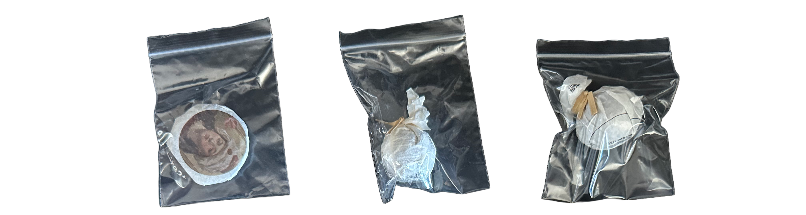

# They're Here!

The wait is finally over! After a week longer than expected, my eagerly awaited package from white2tea has arrived, all the way from Guangzhou. Here's a rundown of the teas that made their way to my doorstep.
If you guys remember my [Teas arriving in May !](https://skoomaden.me/posts/teas-arriving-in-may/) post, you may be shocked to see I *still* didn't recieve everything, and honestly, that's okay, Guangzhou is a long way from here by foot anyway so I guess I'd rather wait for the package to come than go get it myself.

Alright ! Let's get Started !

## The Star of the Show: 2020 Nightlife Cake

First out of the box is the 2020 Nightlife:

"Nightlife is a bud-heavy, high-grade production of yueguangbai [moonlight white] style tea, made from large leaf varietal material usually destined for raw Puer tea. The tea offers a heavy, creamy mouthfeel with an airy sweetness and aroma. It's an enduring white tea with a distinctive character."

I ordered this gem about twenty days ago and I've been counting the days, I cannot wait to review it !

.png>)

## Some sweet extras !

I was suprised to see that I not only got the March Tea Club, But I also got what I suspect to be a [2018 Turtle Dove Mini](https://white2tea.com/products/aged-turtle-dove-mini), a [2024 5th Wave Mini](https://white2tea.com/products/2024-5th-wave-mini?_pos=2&_sid=410882a6b&_ss=r) and a [2024 Great Blue Heron Mini](https://white2tea.com/products/2024-great-blue-heron-minis?_pos=1&_sid=ac6137407&_ss=r) !

These minis are a treat and add a delightful variety to my collection.

## 2018 Hot Brandy from white2tea

Another intriguing selection is the 2018 Hot Brandy, a successful experiment blending white and black teas:

"A mix of sun-dried white and black teas, this blend is thick, smooth, and fragrant. It's suited for multiple brewing styles and boasts impressive endurance, able to withstand prolonged steeping or even boiling without losing its charm."

This tea is a fan favorite for its robustness and versatility.

Now, I didn't get this one yet, but i'll be here soon i'm sure !

.png>)

## Conclusion

Unboxing this collection was a true pleasure, especially after the extra week of anticipation. I'm thrilled to explore each of these teas in depth. Stay tuned for individual reviews and more tea adventures!

  *- yaro*
