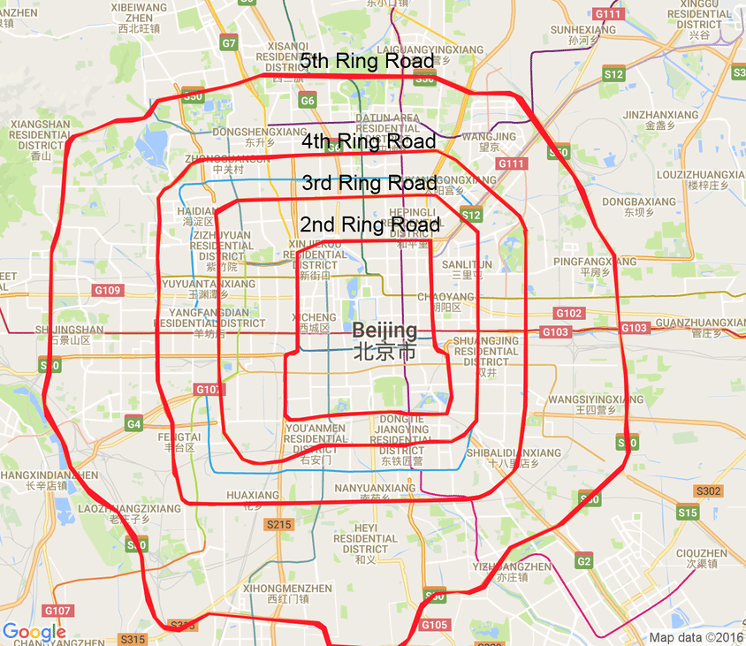
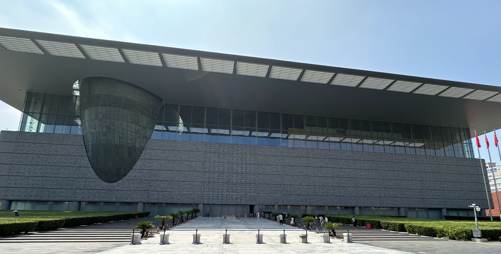
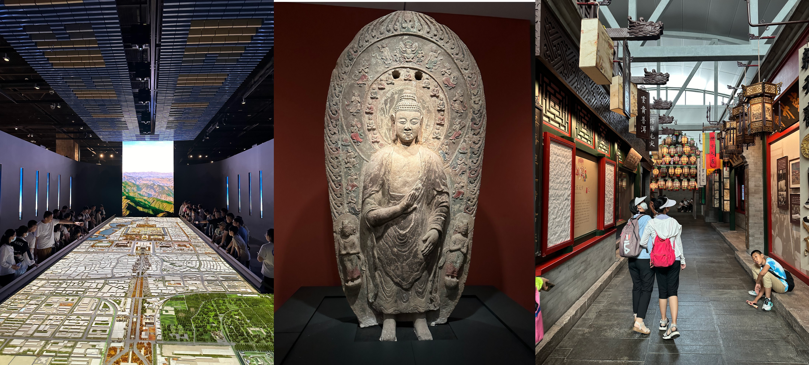

# China Logbook: 10 Days of Stories and Tea

## Day 1: Arrival in Beijing

Well, this sure wasn't my first time in Beijing, and I hope it won't be my last.  
I vividly recall my first voyage to the Imperial City, my high school mandarin teacher organized yearly school trips to Beijing, and that year we had a very different plan than the previous ones.

In an attempt to see what I had seen my first time in Beijing, to explore my new found passion for tea AND to get my mandarin back to work, I have decided to come back for a 10-day trip.

After my arrival, I met a friendly English teacher who went towards the same direction I did in Beijing, we thusly shared our taxi fare together.

I decided to book a capsule hostel of sorts, though much more traditional in nature. Three beds orthogonaly disposed in a single room, with enough space both in bed and in the closets to handle any storage necessities.

It was definitely a suprising experience at first, but as the trip went on I came to love this dorm-like atmosphere, the daily interactions with people in my room and at the reception made my feel like I was at home. And while people in Beijing do make significant effort to accomodate tourists, they also seem to speak Mandarin first (for which I am very grateful) and then try their best to speak some English if they can.

At 3 am, I was finally able to get some well deserved shut-eye, the jetlag having had the best of me.

## Day 2: 您好北京 !
### Hello Beijing !

After waking up, I immediately headed outside to see what the city looked like. A few minutes of walking lead me to the 马草河 (Mǎcǎo River) that lead to a metro station.

Multiples signs around the neighborhood gave the direction of the Line 4 马家堡 (Mǎjīapu) metro station, between the 3rd and the 4th ring.

**_N.B: Perhaps this deserves some explanation; Beijing is often divided into (now) 6 rings, do not be fooled by online maps, the city is absolutely massive. It's home to over 21 million citizens. Anything beyond the 6th Ring is pretty much outside Beijing._**

Majiapu was my first direct encounter with the city's public transportation system, and it certainly exceeded my expectations for such a large city's system. Beijingers are organized, 5元 [_(yuán)_](https://en.wikipedia.org/wiki/Yuan_(currency)) will get you anywhere around the city, that's 70¢ in [freedom units](https://en.wiktionary.org/wiki/freedom_units).

First stop was 永定门 (Yǒngdìngmén), or so I thought.
Rather quickly, I realized the [Gate of Perpetual Peace](https://en.wikipedia.org/wiki/Yongdingmen) was going to stay closed for a while. An hour of Chinese heat atop my head was enough to make me stop making rounds around the park surrounding the gate and determine that no one was present.

I happened to arrive at one of the very rare moments when the park was unfortunately closed.

Nevertheless, I walked all the way to a nearby market where I ordered a DiDi taxi. They're very convinient as well as very cheap, meaning they're precisely the best tool a tourist has to go around the city. I decided, once in the car, that my next stop would be [马连道](https://english.visitbeijing.com.cn/article/47ONH2QkjVX) _(Mǎliándào)_

This is the tea avenue of Beijing, and if I'm being perfectly honest, it's one of the main reasons I went back to China.

I've had some great tea with lots of merchants, most of them being incredibly friendly and understanding of my poor level of mandarin, and we've had great discussions overall.

Some tea cakes were 25+ years old ! Or so the merchants say... I admit for most of the tea I've tried I found their whites too subtle and their greens too bitter, but the Pu'Erhs ? Absolutely mindblowing.

I didn't want most of my travel budget to disappear however, this *was* the first day of my voyage after all. So I contained myself, I bought a total of 200g of tea and decided that the tea market wasn't enough for me. I needed a [show](http://laosheteahouse.com/article/221.html) !

And I show I got friends, at the 老舍 teahouse ! I would love to show you some footage of what the show is like, but out of respect for the incredible late-night show's artists, I would much rather you explore this if you ever go to Beijing. Trust me, the almost magical jasmin tea mixed with the theaterical shows are absolutely worth your money (don't forget to buy some Jasmin tea from the gift shop !).

## Day 3: Tiananmen and Pandas 🐼 !

Getting into the historic [Gate of Heavenly Peace](https://en.wikipedia.org/wiki/Tiananmen_Square) (天安门广场) now requires reservations at least a day prior. Thankfully, before midnight, in bed, my brain suddenly remembered that and I booked for the very next day.

After arriving at the square, I walked into the [Meridian Gate](https://en.wikipedia.org/wiki/Meridian_Gate) and realized that to get into the famed [Forbidden City](https://en.wikipedia.org/wiki/Forbidden_City) I, **again**, needed to get a reservation, and the only one available was on the 10th and last day of my trip.

I kept walking to the left of the [Meridian Gate](https://en.wikipedia.org/wiki/Meridian_Gate) and existed through 东华门 _(Dōnghuámén)_, literaly the Eastern Chinese* Gate, and went outside to get a taxi.

#### _N.B: Interestingly, I knew 华 (huá) as meaning glorious or magnificient, as well as, due to its similarity to the character 花 (huā), flower. It seems however that it also refers to China (ex: 华人 | Chinese People，中华 | Chinese Nation)._

I arrive at the entrance of the Beijing Zoo, this was part of my previous trip with my Mandarin class as well, and I recalled rather well where everything was.

## Day 4: Beihai Park and Performing Arts !

We're headed for the 北海北 (Běihǎi Běi) station, literaly Northern Lake (North) were we'll access the 北海 park.

After standing outside for a bit, due to my ticket starting at noon (I got there at 9 am), I finally got into famous Northern Park. At its center is an island, atop of which lies the [White Pagoda](https://en.wikipedia.org/wiki/Miaoying_Temple).

The walk took some time, I can't even explain how big the park itself is. Access to the island is possible via both a ferry and land. Walking along the Beihai Lake, I seemed to have missed the Ferry and I thusly had to walk about 1.5km to be able to access the "Round City" Gate.

I had the chance to look at many landmarks before getting there thankfully, the minature western Paradise, the Gardens of Economic Plants and the Wanfo Tower.

My arrival at the island was done via the Yong'an Brdige（永安），literaly "Bridge of Eternal Peace". Getting to the Pagoda was a matter of walking up the long stairs that brought you atop the island. Before that however, my attention was spent on a little humble shop that just said "茶" (cha, tea). I entered what I expected to be a shop only to find a teahouse, I saw an elderly man making his tea granpa style: it was the owner. 

Seeing the menu first scared me due to how expensive the propositions were, but truly after thinking about it it was reasonable. about 40元 got me a delicious "Jasmin and Peach" Tea. I was shocked to see granpa style being the common technique around Beijing, I supposed I overestimated how common Gongfu style was.

I was now ready to get to the top of this island, after much walk, I finally saw the Pagoda itself.

Paying a 20元 fee allowed me to get to see both the monument itself and the neighboring structures that were proof of the historic rule of the Qing over the Imperial City.

The architecture was somewhat obviously different from what the Han were used to making. The Qing seemed to have taken much pride from the idea of a multicultural chinese rule, and their art showed as much.

It was now time for me to go back to through the very bridge I came from. Walking back, I stopped by a 回 (Hui) ethnic restaurant where I got some noodles, and then I decided to head towards the Jingshan Park (景山).

This was formally a private Imperial Garden attached to the Forbidden City. It had bonzais everywhere, it felt more akin to a botanical garden than a simple park. That little escapade made me think about what I should do next. I remembered going to a Chinese Opera show when I was younger, so I thought I should head towards the [National Center for the Performing Arts](https://en.chncpa.org).

This place was huge ! I couldn't find any translated Chinese Opera shows, but I decided to see the monthly NCPA choir's show ! This was a magical experience to say the least, lots of different languages and cultural songs, a touch of fun at the end with some cartoon openings being sang which wasn't specified in the planning (so it was extra cool !), and just overall incredible range and talent from everyone involved. The atmosphere was definitely very classy, but not in a bourgeois kind of way. It was more of somewhere you came to well dressed, which surely was not my case at the time.

Getting home was a matter of taking the metro connected to the NCPA, and stopping at Majiapu !

## Day 5: Capital Museum !

On the 5th day, I decided to take a much freer approach to my day by exploring a place I had seen before but that would still be an entire day's worth of entertainment.

So my thoughts directly went to Beijing's [Capital Museum](https://en.wikipedia.org/wiki/Capital_Museum). This place is ridiculously big, the picture you're seeing is a [Fisheye](https://en.wikipedia.org/wiki/Fisheye_lens) I've taken from as far as I possibly could without getting on the nearby highway.
Needless to say, if the exterior is any indication of the contents of the edifice, I will most definitely have my day's worth.

The building itself is 6 stories tall and contains a basement, with both temporary exposition areas and a permanent one.

Of course exploring every single one for the levels here would be counterproductive, instead -- making this day quite short in writing -- I will give you a selection of pictures I took from the museum !

There's lots to say about the Museum's structure and scale, it starts at the birth of the [Chinese civilization](https://en.wikipedia.org/wiki/History_of_China) until the [Cultural Revolution](https://en.wikipedia.org/wiki/Cultural_Revolution). It covers everything in between with much detail, with of course a more nuanced account of the Qing's arrival to power. The Museum puts audio guides for 20元 in both English and Mandarin, though I suppose other languages are perhaps available ? This is one of the more accessible museums in the Capital, as it doesn't require any reservations, and if any **are** somehow required, there would be same-day availability.

This is definitely a must-see for any Chinese history fan ! I of course took many more pictures, but in an attempt to keep enough suprises for you in case you wish to visit, I have only shown what I've found most interesting.

## Day 6: Jade Market and Temple of Heaven !
