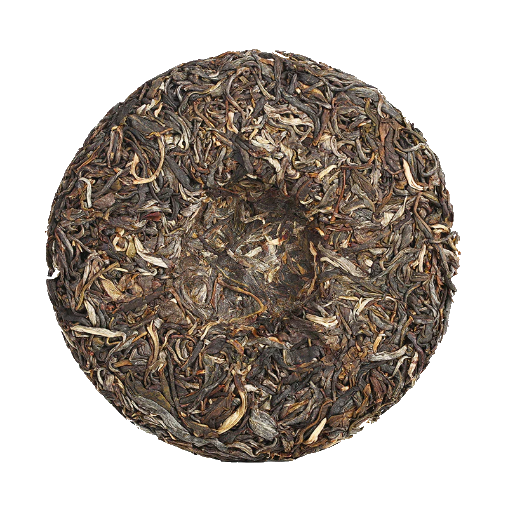

# White2tea Tea Club — June 2024 ! 

Just recieved the June 2024 Tea Club in the mail !


Here's what Paul wrote:

```Thank you for joining us for the June tea club. Spring tea is finally over, marking the end of another long growing season in the tea mountains. By the time this package hits your door our first wave of new teas should be up on the site, with more pressings to come. We appreciate you sticking with us through the spring and beyond, we've got a lot of interesting clubs on the horizon, including educational comparisons of white teas from Fujian.

Before we get to the teas, a few notes on the 2024 spring. You may have noticed our releases were later this year than usual. Drought played havoc with weather around Meng-hai and Yiwu this spring. Many of our old arbor teas from Yiwu for example, were not picked until late April, whereas in previous years they would have been ready in early April.

The tea trees were struggling to find moisture to push forth fresh growth, with yields suffering as well. One farmer who last year produced 60-80 kilograms in the spring, this year had only 6 kilograms. This is an extreme anecdote, but worth mentioning because many of the old arbor trees or forest teas simply didn't produce fresh leaf. The good news is that as write this it is raining in Xishuangbanna, so t least some moisture is on the way. We appreciate all of you who have been patiently waiting for our new teas to come out!

2024 Green Hype - 200g - Raw Puer blend from Yunnan. Every spring I say, "that's it, this is the last green hype" and then the next spring I continue to make it. I don't know why I can't quit. Maybe because it seems like a tradition. Maybe it's because the blend is solid.

Whatever the reason, here again is our burly little everyday Puer. Back in 2017 we tested this blend for the EU MRL and it came back totally clean. Though we haven't tested it since, the blend and regions we draw from remain the same. It's a clean tasting, flavorfu! blend with fragrance and lingering sweetness. You've got a full cake, so try it out now and age the rest as you please. Or brew it every day for a month until it's gone. It's your tea and we won't tell you how to live your life. If this is your first introduction to the Hype, we recommend picking up a sample or a cake of our initial 2017 blend to compare how our whitestorage and 7 years of age has transformed it.

Lao Chuan Hong - Switching provinces to Sichuan, where we spent a significant amount of the spring tea season this year. We commissioned a hongcha [literally red tea in Chinese, or what most Westerners know as black tea] to be made from material that this Sichuanese producer usually makes into green tea. The results are beautiful, brightly aromatic and engaging. We love using tea materials for productions that are different than the usual fare; it keeps things interesting. And besides, if some asks you "what's a unique tea you had recently?" you can say "a black tea from Sichuan province that is usually only made into green tea" with a smug smirk and everyone will clap. (don't do this)
Brewing Instructions- Boiling water, even for the very fresh raw Puer. Use gongfu style brewing if you can. If you'd like a softer experience, drop the temp to 85C - 95C, this will lessen the harsher notes of the tea. 90C-95C for the black tea will coax out different aromatics and favors, but will still prefer boiling.

A repeat note from last month; we are ambitiously planning to update our tea club payments to be through Shopify in the coming months instead of Paypal. This will theoretically mean that you can receive automatic tracking through your http://white2tea.com account. However, we're not done quite yet, we will make an official announcement when its possible!
We will see you online, don't forget to hashtag us #white2tea```

Alright alright, let's see what the package is all about this month:

## 2024 Green Hype

 

"The latest installment in the Green Hype saga. A significant amount of aged material in the blend to smooth out the experience. The new material in the blend is punchy and full bodied with an intense huigan [the lingering sweetness in the mouth after drinking a tea]. Excellent daily drinking raw Puer with plenty of intrigue and character to keep you engaged from cup to cup." 

The Hype is one of the if not the most well know w2t tea with "This is", definitely one of my Spring favorites that I was shocked to see arrive in the mail. This is probably the most value we got out of a w2t tea Club, it's just amazing and I cannot wait to review it here soon.

## Lao Chuan Hong


Now I admit this is where my knowledge of Black Tea stops, Lao Chuan Hong is a supposed well know hongcha (Red Tea in China) but I admit, reading the description we got, I cannot stop being curious about what I possibly await with this one.

I'll definitely try both of these teas right now !

Either way, Stay tuned for more Tea Reviews !

*- yaro*
