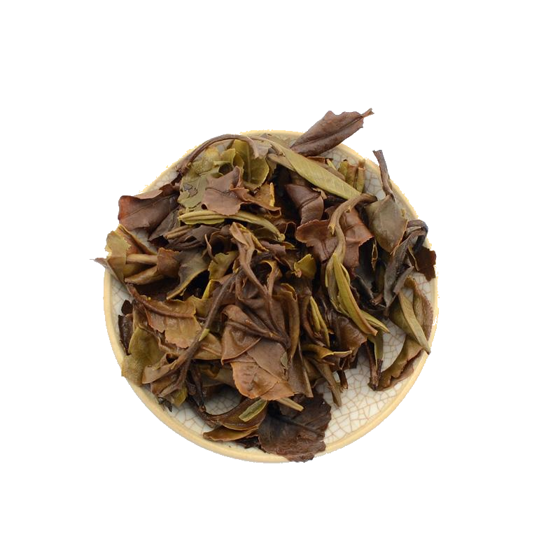

# Review of 2018 Turtle Dove by white2tea

I recently tried the mini version of 2018 Turtle Dove by white2tea. Here's my detailed review of the experience:

Preparation:

- **Temperature:** 185°F / 85°C
- **Time:** 10s, 15s, 20s, 25s, 30s
- **Tea Amount:** 5 g
- **Water Volume:** 3 oz / 100 ml

## Overview

I brewed this tea using the Gong Fu style, hoping to explore its depth through multiple short infusions.

### First Infusion (10s)

- **Color:** White wine
- **Flavor:** Very superficial, with hints of wool and mustiness without much definition.

### Second Infusion (15s)

- **Flavor:** The mustiness is now complemented by a very subtle sweetness that appears only in the aftertaste. There's also a faint earthiness that requires careful attention to notice.

### Third Infusion (20s)

- **Flavor:** Similar to the previous steep, with pronounced notes reminiscent of pungent meat and wet wool. Despite these strong flavors, there's no bitterness.

### Fourth Infusion (25s)

- **Flavor:** No significant change from the third steep. The same musty and wool-like flavors persist.

### Fifth Infusion (30s)

- **Flavor:** The flavor profile remains unchanged, continuing with the same musty and wool-like notes.

## Overall Impression 

In conclusion, the 2018 Turtle Dove by white2tea was not an exceptional tea. While it had consistent flavors across the steeps, these flavors were not particularly enjoyable or memorable.

## Rating:

- **Flavor Complexity:** 10/30 - The tea lacked distinctive or exceptional flavors.
- **Brewing Forgiveness:** 14/20 - The tea's flavor did not evolve significantly with different steeping times.
- **Consistency Across Infusions:** 15/20 - The tea was consistent, but consistently unimpressive.
- **Overall Enjoyment:** 10/30 - The tea was drinkable but not enjoyable or exciting.

### My recommendation: Would not recommend for those seeking a memorable or exceptional tea experience.

# 49/100

*- yaro*
