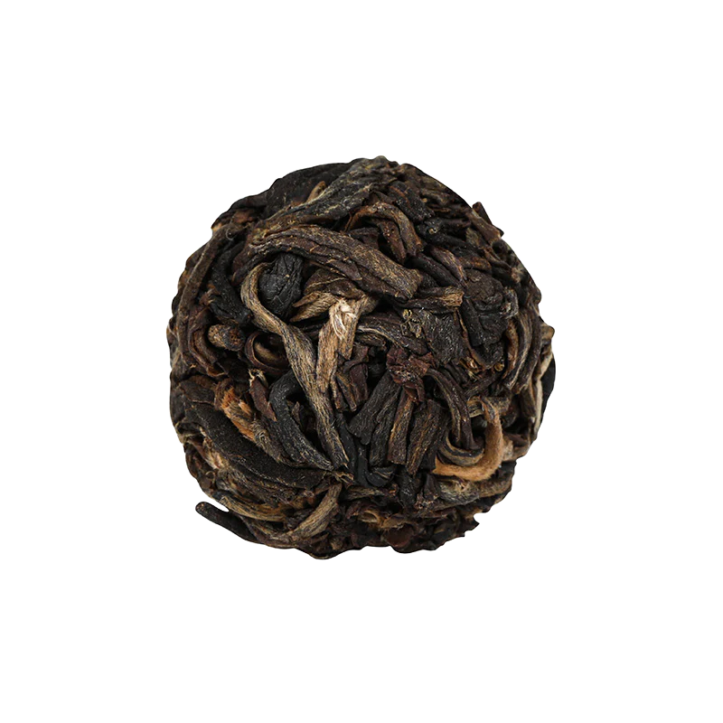
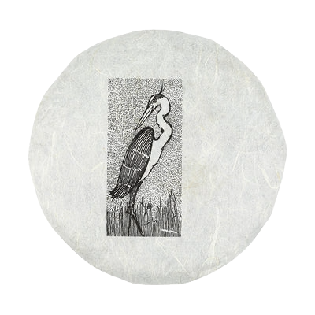

# Review of 2024 5th Wave by white2tea

.png>)

Already at the smell, I get this classic fishiness we get from shou puers. It smells like a Lin Cang puer, though the charcoal-roasted part isn’t necessarily obvious. The soup is thick; both the wash and the first steep were maroon.

## Preparation

- **Temperature:** 203°F / 95°C
- **Time:** 10s successive infusions
- **Tea Amount:** 0.25 oz / 7 g
- **Water Volume:** 6 oz / 180 mL Yixing teapot (it looks so cool!)

## Overview

I brewed this tea using a Yixing teapot, hoping to explore its depth through multiple short infusions.

### First Infusion (10s)

- **Flavor:** So earthy! This makes my cheap Lin Cang taste like mud in comparison. Very light and pleasant at this temperature and brewing time.

### Second Infusion (3s)

- **Flavor:** This smells and tastes exactly like an espresso, and a strong one at that. The soup is thick, and close to black rather than red. Strong grainy smoky smell, exactly like freshly brewed coffee. It’s not unpleasant tasting, but just like its coffee counterpart, I don’t think this would qualify as a crowd pleaser.

### Third Infusion (90°C, 5s)

- **Flavor:** I cannot fathom the caffeine content in this; it has to be insane. I wouldn’t drink this at night, just like other puers. I just don’t have the vocab necessary to explain what I’m drinking. It’s coffee, shockingly coffee, and just like coffee, that final bitterness that hits in the aftertaste is either highly appreciated or hated.

### Fourth Infusion (85°C, 2s)

- **Flavor:** Yeah, that’s coffee, not much to say and the flavor probably will evolve to taste more and more like it. This is fascinating.

## Impressions

Well, I just read w2t’s own description of the thing, I guess they got the exact same notes I did. This is coffee. I’m very surprised by what the talented hands out there can make—a tea that tastes like coffee? That’s definitely uncommon.

## Rating

- **Flavor Complexity:** 15/30 – Complexity is where I guess it should be. This isn’t one of those multilayered teas, but what it lacks in complexity it definitely makes up for in originality.
- **Brewing Forgiveness:** 20/20 – This tea is definitely forgiving. I started with near boiling and ended at a cooler 85°C yet this tea showed a lot of resilience.
- **Quality Across Infusions:** 15/20 – It was definitely a consistent and high-quality tea.
- **Overall Enjoyment:** 20/30 – This tea is highly original, a surprising take on what seems at first, at least smell-wise, like a very classic shou puer. Definitely up there with the most interesting teas I’ve, humbly, tried so far.

**Flavors:** Coffee, Earthy, Espresso

# 70/100

*- yaro*
