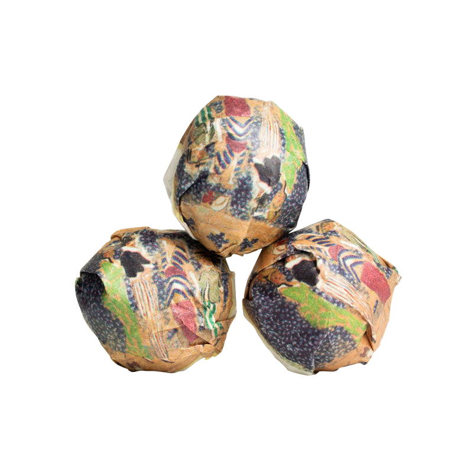
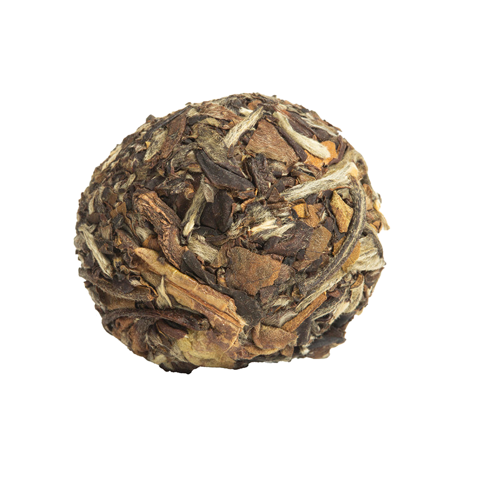

# Review of 2024 Nightlife Mini by white2tea

New Nightlife review, let’s see how this year’s batch holds up.

## Preparation

- **Temperature:** 205°F / 96°C
- **Time:** 30s, 20s
- **Tea Amount:** 7 g
- **Water Volume:** 4 oz / 110 mL

## Overview

The 2024 Nightlife Mini maintains the classic quality of the previous versions, particularly similar to the 2017 batch. It’s a nice tea, though there isn’t much new to report compared to my previous reviews.

### Steepings

#### 1st Steep (205°F / 96°C, 30s)

Nice and light, not any difference with the 2017 Nightlife for now. It’s really nice.

#### 2nd Steep (205°F / 96°C, 20s)

Not much to say, it’s a nice tea for sure but there isn’t anything interesting more to say compared to the review I’ve already made of the 2017 Nightlife.

#### 3rd Steep (205°F / 96°C, 20s)

Same thing again, nothing very interesting to say. I love this tea, it’s a classic.

Knowing that, I’ll just go ahead and copy the review conclusion I made for the previous version of the Nightlife:

## Overall Impression

The 2024 Nightlife Mini is a delightful tea that offers a consistent and enjoyable experience, particularly in the early steeps. While it becomes predictable, it remains a highly enjoyable classic.

## Rating:

- **Flavor Complexity:** 25/30 – Offers a delightful range of flavors, particularly in the early steeps.
- **Brewing Forgiveness:** 15/20 – Can become bitter if brewed incorrectly, but generally performs well with proper care.
- **Consistency Across Infusions:** 15/20 – The flavors evolve but maintain a coherent profile.
- **Overall Enjoyment:** 20/30 – Highly enjoyable in initial infusions, but becomes predictable and less exciting.

# 75/100

*- yaro*
