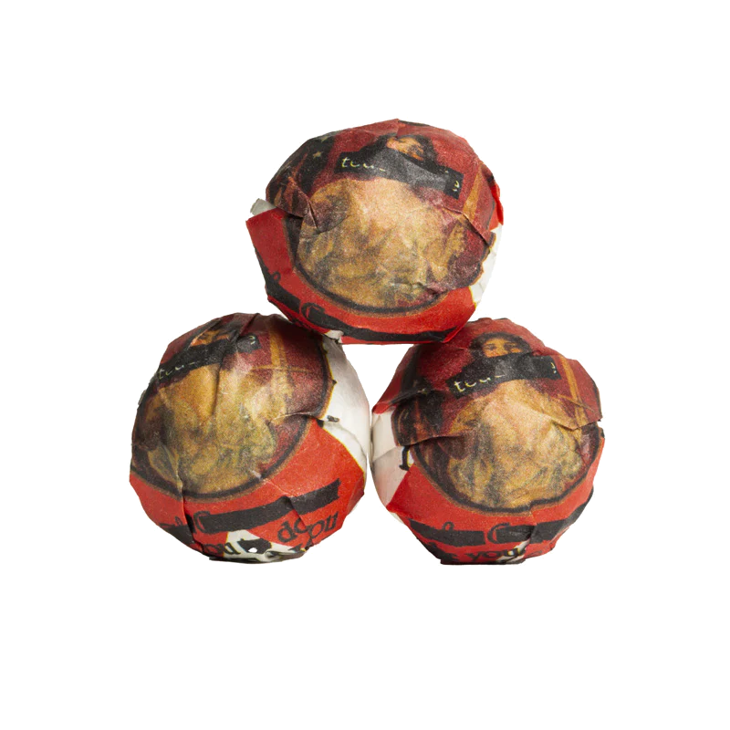

# Review of 2024 teadontlie Minis by white2tea

I recently tried the 2024 teadontlie Minis from white2tea.

## Preparation

- **Temperature:** 205°F / 96°C
- **Time:** 15s, 20s, 25s
- **Tea Amount:** 7 g
- **Water Volume:** 3 oz / 100 mL

## Overview

The 2024 teadontlie Minis started light and sweet but quickly turned vegetal and bitter, making for an unenjoyable experience overall.

### Steepings

#### 1st Steep (205°F / 96°C, 15s)

Light and sweet.

#### 2nd Steep (205°F / 96°C, 20s)

Vegetal and it starts getting bitter for no reason.

#### 3rd Steep (205°F / 96°C, 25s)

Ouch, too bitter for me. This is probably not gonna get any better, I know where this is going…

## Overall Impression

The 2024 teadontlie Minis quickly turned from a light and sweet tea to a bitter and vegetal experience, making it less enjoyable overall.

## Rating:

- **Flavor Complexity:** 15/30
- **Brewing Forgiveness:** 15/20
- **Quality Across Infusions:** 10/20
- **Overall Enjoyment:** 10/30

# 50/100

*- yaro*
