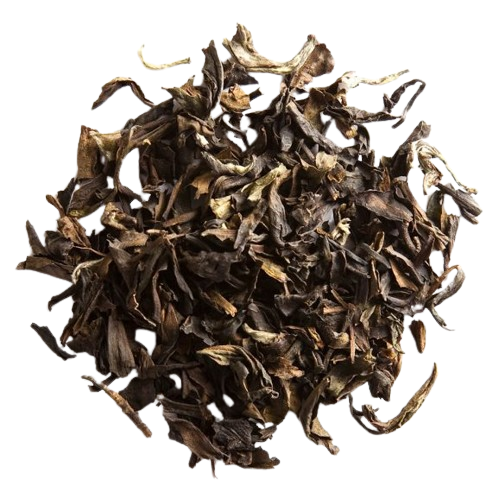

# Review of Butterfly of Taiwan by Palais des Thés

I recently tried Butterfly of Taiwan from Palais des Thés.

## Preparation

- **Temperature:** 205°F / 96°C
- **Time:** 15s for each steep
- **Tea Amount:** 2 g
- **Water Volume:** 3 oz / 100 mL

## Overview

Butterfly of Taiwan is a honey-like, sweet tea that offers a balanced and pleasant experience. Despite being on the lighter end, it provides a good equilibrium of flavors, making it one of the best offerings from PDT.

### Steepings

#### 1st Steep (205°F / 96°C, 15s)

Honey-like, sweet.

#### 2nd Steep (205°F / 96°C, 15s)

Overbrewed it but it’s still very good.

#### 3rd Steep (205°F / 96°C, 15s)

Nice good equilibrium on the top, very round taste, definitely one of the best offerings from PDT.

## Overall Impression

Butterfly of Taiwan is a good session tea, especially light and fitting well as a breakfast tea. It shows high quality and resistance to overbrewing.

## Rating:

- **Flavor Complexity:** 15/30 – What it lacks in complexity, the tea gains in balance; it’s on the lighter end.
- **Brewing Forgiveness:** 15/20 – Seemed to take my 95°C pretty well!
- **Quality Across Infusions:** 17/20 – Definitely high quality and it resisted overbrewing.
- **Overall Enjoyment:** 25/30 – I liked this. It’s a good session, very light, a good breakfast tea.

# 72/100

*- yaro*

## Flavors:

- Honey
