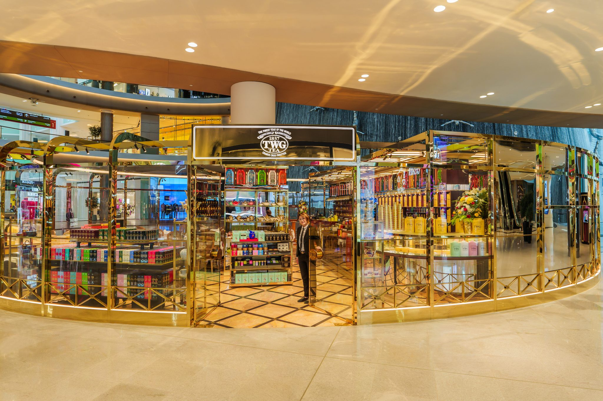
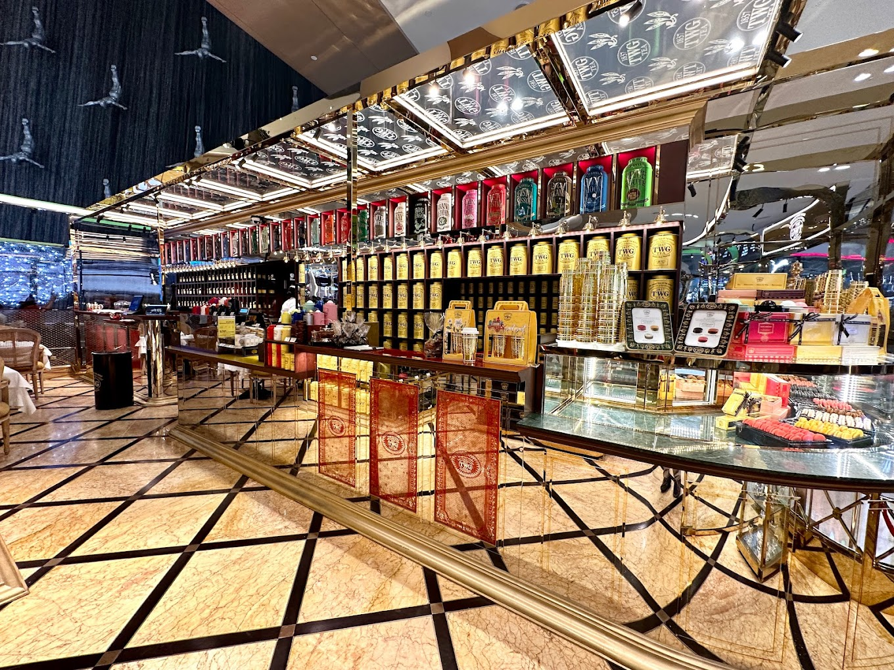

# Review of TWG's Breakfast Teas

Often regarded as an overpriced copy of Mariage Frères, Singaporean brand TWG has a mixed reputation among tea lovers worldwide. Some claim that the brand artificially inflates its image, attaching a false sense of history and luxury.

Arguably, this is not entirely untrue.
The brand’s use of "1837" refers to the year Singapore opened its trade market, not TWG's founding (2008). Additionally, there are clear resemblances between TWG and Mariage Frères in both language and design, with some teas even sharing the same name (_e.g._, [Sakura! Sakura!](https://www.reddit.com/r/tea/comments/1bzsg3x/whos_copying_who_now/)). Furthermore, the heavily perfumed nature of many TWG teas often divides opinions.

The Wellness Group's (TWG) history is well rooted in business, the luxury brand was made by both Manoj M. Murjani (A Hongkongese of Indian descent) and Taha Bouqdib (A French-Moroccan tea sommelier) as a way to cater to what was then an untapped market of luxury french-style brands in Asia. Singapore makes sense due to the diverse identity of the country and its strategic position in the world stage.

TWG prides itself of its international fame, often claiming that it has mastered teas from all over the world. This is quite a bold claim, knowing that most Asian tea houses only have expertise in one kind of tea, and often regional ones too. European brands that have had similar claims in the past have almost all disappointed me. "Jack of all trades, master of none" is the first thing that came to my mind when reading the long Tea List they had provided. I had flashbacks of Palais Des Thés' horrible artifical teas, truly an experience I didn't want repeated.

With this complex reputation in mind, my first visit to a TWG shop was clouded by low expectations. I went with a friend, hoping they could provide an unbiased perspective on the tea's taste.

## The Shop

I went to [Dubai Mall](https://en.wikipedia.org/wiki/Dubai_Mall)'s TWG Tea, which serves as both a teahouse and a teashop.
Prices range from 10-30 USD for what seems to be a 400mL teapot.
After getting seated next to the fountain, I decided to order two teas in a strategic way that I will describe while covering them.

## First Tea: Moroccan Mint Tea

Being myself from the region, I know Moroccan Tea rather well -- Taking this would serve as a great benchmark for the overall knowledge of their teas.

Traditional preparation for the tea involves using Gunpowder Green Tea (or Vietnamese Green for Royal Moroccan Teas), Mint (any type is fine, though usually fresh spearmint is used), and a heavy amount of sugar.

The tea is infused for a very long time, you would first put in the tea leaves with boiling water in a metal teapot that would sit on fire, you would then wash the tea (pouring it out) and start again, now adding the spearmint and sugar. Infusion time is about 5-15 minutes depending on the tea used and region.

Pouring the tea is itself a complex process too, if the tea is too hot (due to the infusion involving constantly boiling water) we would place two cups, pour tea in one and then move it to the other sequentially until the tea cools down.

The idea of Moroccan Tea is to be incredibly refreshing and sweet, while being round and flavorful. Building a balanced tea with such strong flavors is very technical, and it takes years for many to master this tea correctly -- especially knowing that the constant heat during infusion is impossible to obtain without tools that don't exist in Asia.

**My friend**: "It's minty, with just a hint of green tea. Since I’m not a fan of green tea, I didn’t enjoy the bitterness (possibly from the gunpowder base). It’s okay but not remarkable."

**Me**: The mint notes in this tea were faint, far subtler than what I'm used to. Although the staff first claimed it was Vietnamese Green being used, I suspected it to be regular gunpowder, which they have later confirmed. With sugar added, the tea became quite interesting. As a Moroccan man familiar with mint tea, I found the flavor a bit too mild, but I appreciated the balance. The preparation was done well, though. For a faint brew, it was solid.

## Second Tea: Singapore Breakfast

The Singaporean Breakfast is a staple of TWG's. Supposedly, it was made by the two founders of the house to represent the complex identity of the city-state: Malay, Indian and Chinese -- Spice, Malt and Citrus.

**My friend**: "It’s a black tea, so it has that typical bitter aftertaste. It’s not great, almost like cinnamon with some spices. The smell is perfumy, but I couldn’t taste any vanilla. The tea doesn’t linger on the palate—it’s just a standard black tea. Maybe it would taste better with something sweet on the side since it’s a breakfast tea."

**Me**: This tasted like an Assam black tea, with the perfumed quality reminding me of something from Palais des Thés. Citrus peel and spices give the tea its body, along with a faint note of red fruit. I couldn’t detect cinnamon or vanilla at first. However, when I added sugar (which I rarely do), the tea’s fruitiness really came through, and the cinnamon became more obvious. 

It’s a confusing tea, but excellent nonetheless. I had expected something similar to Palais des Thés but got something unique. Teas that maintain or even improve with sugar are rare, and these TWG offerings certainly stood out in that respect.

## The Tea Shop

A large portion of the house itself was dedicated to selling tea with the conventional min. of 50g, I was presented with a nice licorice tea for about 20¢/g along with an absolutely incredible Da Hong Pao (which was also overpriced). The guarantee of it being the real thing, I admit, convinced me. And again, this was not a shockingly expensive experience especially for the city I was in.

## Conclusion

Thankfully, this is much better than Palais des Thés. However, a brand that prides itself for its high quality and luxury must be judged as such.

Overall, the tea is good and well balanced and the preparation was satisfatory: The water wasn't too hard, and I didn't feel any sharpness in the soup, but the taste lacks roundness either, most of the definition is located in the front of the tongue which is very unfortunate.

A lot of the flavor, especially in the Singaporean tea, needed sugar to come out, and while usually this is a bad sign for any high quality teas; But in the context of this being a Breakfast Tea, sugar is usually to be expected in most of the western world. The Moroccan tea was the biggest shock for me, this was better than most Moroccan restaurants I've been to with sugar. This could be explained by a number of factors, but arguably the simplest one of them all is that Taha Bouqdib is a French-Moroccan sommelier, and I wouldn't expect any less from someone like this to be able to master it properly -- creating a reciepe that would allow for fast infusion while preserving the Moroccan tea taste.

It was a good experience, it sure could be overpriced but the atmosphere was nice and really felt like a nieche tea place with teas that aren't unjustifiably expensive, I spent 10$ for each tea, and I wouldn't pay any more than that.

All of this being said, I have not tried their pure teas yet, but their breakfast blends were pretty enough for me to recommend this place whole heartedly to someone who just wants to have a little morning treat before going to work. I just wish they toned down the whole copying Mariage Freres thing, I am certain TWG can build a proper reputation within the community without pretending to be this ancient french tea company...

Well, that's it for now, thank you all for reading !

  *- yaro*